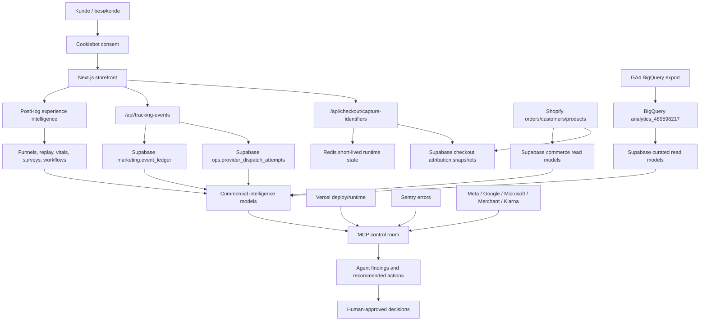

# Utekos Commercial Intelligence & Agentic Operations

Statusdato: 2026-07-08.

Dokumentasjonsstatus: Tilstrekkelig for styringsplan og docs-only
implementering. Offisiell dokumentasjon for Vercel Workflows, Vercel Queues,
Supabase BigQuery Wrapper og GA4 BigQuery Export er kontrollert, og lokal
runtime-status er sjekket read-only. Dette dokumentet beskriver retning,
eierskap, gates og prioritering. Det utfører ingen provider-, database-,
workflow- eller deploy-mutasjoner.

Dette dokumentet er styringsplanen for hvordan Utekos går fra "samle data" til
aktiv kommersiell innsikt, automatisert observasjon, bedre brukerforståelse,
trygg kundehjelp og bedre kapitalallokering. [FLOW.md](FLOW.md) beskriver den
operative end-to-end-flyten og avvikene. [PLAN.md](PLAN.md) beskriver
release-/plattformstatus og gates. Denne planen binder sammen de kommersielle
modellene, agentlaget, workflow-valgene og neste prioriterte arbeid.

## Prinsipper

- Supabase er primær sannhet og orkestreringsanker.
- BigQuery brukes til tung GA4-/ads-/batchanalyse, ikke som live app-avhengighet.
- PostHog brukes aktivt til CRO, produktinnsikt, web vitals, session replay,
  heatmaps, surveys, workflows og senere Signals/scouts.
- Redis brukes bare til kortlevd runtime state. Varig checkout-attribusjon skal
  finnes i Supabase snapshots.
- Vercel Workflows brukes for robuste, flertrinns prosesser der appen eier
  businesslogikken og trenger pause, resume, retries, observability og
  idempotens.
- Agenter/MCP er read-only + forslag i v1. Mutasjoner krever eksplisitt gate.
- Kundeservicechatboten skal gi trygghet, produktforståelse og bedre
  brukervennlighet. Den skal ikke være en aggressiv salgsflate.
- Data samles kun når det finnes en tydelig beslutning eller operasjonell
  handling som skal bli bedre av den.

## Nåstatus

- Supabase production har varig checkout-attribution snapshot-tabeller i
  `marketing.checkout_attribution_snapshots` og
  `marketing.checkout_attribution_lookup_tokens`, men siste
  identifier-coverage-rapport viser fortsatt 0 faktiske snapshot-rader. Vercel
  logs siste 6 timer fant ingen `capture-identifiers` eller snapshot-persist
  feil, og Supabase viste ingen `InitiateCheckout` etter siste production
  deploy. Runtime er deployet, men snapshot-capture er ikke data-bevist før
  neste samtykkede checkout-capture.
- Runtime som skriver Redis + Supabase snapshot og bruker Supabase fallback ved
  Redis-miss er deployet til Vercel production:
  `utekos-headless-55g9vsbve-utekos-marketing-group.vercel.app`, opprettet
  2026-07-08T18:55:14.894Z, `READY` for target `production`.
- Full Shopify-historikk er importert til `commerce`: 804 ordre og 1222
  linjevarer i `commerce.shopify_order_snapshots` og
  `commerce.shopify_order_line_items`.
- Shopify attribution-readiness viser at historikken har store hull:
  535 ordre mangler GA client id, 263 mangler paid click id,
  4 er klare for provider-repair og 2 mangler Meta browser ids.
- GA4 BigQuery-linken for property `489598217` er aktiv med daglig eksport og
  `includeAdvertisingId=true`, men BigQuery-datasettet
  `analytics_489598217` finnes ikke ennå i
  `project-c683eb2c-20ae-4ec2-ac3`. `npm run
  ops:ga4-bigquery-readiness` er den read-only gaten for å verifisere dette
  før Supabase BigQuery Wrapper eller kuraterte GA4-read-models bygges.
- PostHog har aktivt event-inntak, men mangler ferdige Utekos-dashboard for
  produktfunnel, checkout, landingssider, UTM/kampanjeadferd og replay-shortlist.
- PostHog Workflows er ikke tatt i bruk. Første bruk skal være interne signaler
  og drafts, ikke kundevendte automasjoner.
- MCP/commerce doctor har verifisert en bred read-only tool-surface, men noen
  provider-prober er fortsatt credential-/scope-gated.
- Microsoft UET CAPI purchase er ikke grønn. Vercel har UET CAPI-token-env
  konfigurert, og `missing_capi_token` er nå historisk radgjeld i rapporten.
  Nyeste Microsoft UET purchase-rad feiler fortsatt på `missing_attribution`, så
  neste bevis må være ny samtykket checkout-capture og purchase smoke.
- `npm run ops:identifier-coverage-report` er første P0-operasjonsflate for
  identifier coverage, Shopify attribution readiness, checkout snapshots,
  purchase delivery og dead letters.

## Målarkitektur

## Integrasjonsroller

| Integrasjon | Rolle | Utnyttelse videre | Ikke bruk til |
| --- | --- | --- | --- |
| Supabase | Kanonisk operasjonelt lager | Customer/order/product/session/attribution-modeller, provider health, dead letters, alerts, agentfunn, beslutningslogg | Rå produktanalyse alene eller PII-frie replay-flater |
| BigQuery | Tung GA4-/adsanalyse | Historisk GA4, kampanje-/sourceanalyse, batchjoin mot Supabase-modeller | Live runtime-avhengighet eller rå GA4-dump i appflyten |
| PostHog | Experience intelligence | Funnels, web vitals, replay, heatmaps, surveys, workflows, Signals/scouts | Finansiell fasit, provider-audit, rå payloads eller PII |
| Redis | Kortlevd runtimekobling | Checkout-attribusjon, dedupe, runtime handoff | Langtidslager, analysefasit eller rapportering |
| Vercel Workflows | Durable app-prosesser | Backfills, agent-jobber, eksterne API-kall, chatbot-evals, multi-step retries | Provider-mutasjoner uten egen approval gate |
| MCP/agenter | Kontrollrom og diagnostikk | Lese Supabase/PostHog/Vercel/Shopify/Sentry/providers og foreslå tiltak med bevis | Skjulte writes, GTM publish, campaigns, schema changes |
| Shopify | Commerce source of truth | Kunder, ordre, produktstatus, cart/order attributes, historiske attribution-hull | Analytics-hovedlager |
| Google/Meta/Microsoft | Annonse- og optimaliseringsflater | Match rate, conversion delivery, campaign/source performance, policy/status | Ukontrollerte writes eller dobbelttelling |
| Klarna/Shops/Agentic Catalog | Distribusjons- og discoveryflater | Feedstatus, produkteligible, ubenyttet ads-verdi, salgsmuligheter | Tracking-fasit |
| Chatbot | Kundehjelp og kvalitativ innsikt | Produktvalg, trygghet, størrelser, materialer, bruk, vask, levering, retur, friksjonslogging | Ordre-/provider-mutasjoner uten auth og eksplisitt gate |

## Shopify/Vercel Installasjonsgate

Vercel sin Shopify-integrasjon kan installeres nå, men den skal behandles som
en credential-/storefront-kobling, ikke som ferdig commerce intelligence. Den
kan auto-konfigurere Shopify credentials i Vercel-prosjektet, mens Utekos
fortsatt må bevise hvilke env-vars, scopes og webhooks som faktisk finnes
etter installasjon.

### Formål

- Koble riktig Shopify-butikk til riktig Vercel-prosjekt.
- Sikre at storefront-runtime fortsatt bruker `SHOPIFY_STORE_DOMAIN` og
  `SHOPIFY_STOREFRONT_ACCESS_TOKEN`.
- Holde Admin GraphQL-token, ordretilgang, webhooks, Supabase Vault og
  historikkimport som separate gates.
- Unngå at marketplace-installasjonen skjuler nye writes, katalogmutasjoner
  eller provider-endringer.

### Før installasjon

- Velg eksisterende live store når målet er produksjonsdata. Bruk ikke dev
  store dersom hensikten er attribution, historikk og kundeinnsikt.
- Verifiser at installasjonen skjer mot Vercel-prosjektet som eier
  `utekos.no`/`www.utekos.no`.
- Noter hvilke Shopify-scopes UI-et ber om. Storefront-token er nok for
  produkt/cart/checkout-runtime, men Admin-ordre/kunder krever Admin API
  scopes.
- For historiske ordre eldre enn 60 dager må Shopify-tilgangen dekke
  `read_all_orders` sammen med ordrelesing. Uten dette kan backfills gi et
  falskt bilde av komplett historikk.

### Etter installasjon

Kjør eller inspiser disse punktene før integrasjonen regnes som operasjonelt
aktiv:

1. `vercel env ls` skal vise hvilke Shopify-variabler integrasjonen opprettet,
   uten at verdier eksponeres i chat eller docs.
2. `vercel env pull .env.local` kan brukes lokalt bare hvis vi bevisst vil
   oppdatere lokale utviklingsverdier. Eksisterende `.env.local` skal ikke
   overskrives blindt.
3. Sjekk at produksjon har:
   - `SHOPIFY_STORE_DOMAIN`
   - `SHOPIFY_STOREFRONT_ACCESS_TOKEN`
   - `SHOPIFY_ADMIN_API_TOKEN` hvis Admin GraphQL, katalogsync, Customer Match,
     Klarna order bridge eller Shopify historikk-backfill skal brukes.
   - `SHOPIFY_WEBHOOK_SECRET` hvis Shopify webhooks skal valideres.
4. Kjør read-only Shopify-prober:
   - Storefront product probe.
   - Admin catalog probe.
   - Eventuell order/customer probe når scope er bekreftet.
5. Ikke deploy runtime på nytt bare fordi env er endret før deploy-gaten i
   [DEPLOYMENT.md](DEPLOYMENT.md) er fulgt.

### Scope-policy

- Storefront: produkter, varianter, cart og checkout-opprettelse for
  headless storefront.
- Admin read: produkter, kunder og ordre til katalogsync, Customer Match,
  Supabase commerce-modeller og attribution-readiness.
- Admin write: ikke aktivert som standard. Katalog-, ordre-, kunde- eller
  webhook-writes krever egen eksplisitt godkjenning.
- Provider- eller GTM-endringer er ikke del av Shopify-installasjonen.

### Verifikasjonsbevis

Installasjonen er ikke "ferdig" før disse bevisene finnes:

- Vercel-prosjekt og environment-scope er riktig.
- Shopify store domain matcher live butikk.
- Storefront probe returnerer produktdata.
- Admin probe returnerer kun read-only data med riktig API-versjon.
- Webhook-ruter finnes og HMAC-validering bruker riktig secret hvis webhooks er
  aktivert.
- Supabase Vault og commerce bridge bruker samme butikk/token som Vercel, uten
  at tokenverdier lagres i SQL, docs eller chat.

## Supabase-modeller

Første datamodell skal være read-model-orientert. Målet er at agenter,
dashboards og mennesker leser kuraterte flater, ikke råtabeller.

### Commerce

- `commerce.shopify_order_snapshots`: historiske og nye ordre fra Shopify.
- `commerce.shopify_order_line_items`: linjevarer, produkt-/variantkobling og
  revenue.
- `commerce.shopify_order_attribution_readiness`: readiness og manglende ids.
- Neste read models:
  - customer lifetime/repeat/revenue.
  - geografi: postnummer, kommune, landsdel der datagrunnlaget er lovlig og
    nyttig.
  - produktprestasjon per variant, periode og traffic source.

### Sessions og attribution

- Sessions skal koble GA client id, session id, PostHog person/session,
  anonymous visitor, consent snapshot og paid click ids der det finnes lovlig
  grunnlag.
- Attribution-readiness må måles som coverage, ikke bare absolutte mangler:
  `client_id`, `ga_session_id`, `fbp`, `fbc`, `gclid`, `gbraid`, `wbraid`,
  `msclkid`, UTM og consent state per steg.
- Historiske hull skal klassifiseres som:
  - reparerbar med Shopify/Supabase/GA4/PostHog-data.
  - ikke-replaybar på grunn av manglende identifier.
  - utenfor provider-vindu.
  - bevisst parkert.

### Provider health

- `ops.provider_dispatch_health` og `ops.dead_letter_summary` skal være
  faste beslutningsflater.
- Dead letters skal ikke vurderes som rå antall. De må grupperes etter
  provider, reason, unresolved/resolved, replay-policy og kommersiell konsekvens.
- Purchase delivery skal ha egen statusflate for Meta CAPI, GA4 Measurement
  Protocol og Microsoft UET CAPI.

### Agent findings

Ny agentlogikk skal skrive funn til egne read-/audit-flater før den gjør noe
annet. Foreslått minimum:

- funn-id, kilde, alvorlighet, berørt integrasjon, observasjon, bevislenke,
  anbefalt handling, eier, status og beslutningslogg.
- egen klassifisering for "mangler credential", "reell providerfeil",
  "datakvalitetsfeil", "lav kommersiell utnyttelse" og "krever menneske".

## BigQuery til Supabase

GA4 BigQuery-export skal kobles til Supabase først når datasettet
`analytics_489598217` finnes i BigQuery. Det skal ikke bygges wrapper/read
models mot et datasett som ikke eksisterer. Bruk `npm run
ops:ga4-bigquery-readiness`; statusen er ikke grønn før rapporten viser
dataset, region og minst én `events_*` eller `events_intraday_*` tabell.

Når datasettet finnes:

1. Verifiser tabeller og region i BigQuery.
2. Opprett Supabase BigQuery foreign server read-only med service account i
   Vault.
3. Eksponer bare kuraterte modeller til videre arbeid:
   - session/source/campaign performance.
   - landing page performance.
   - product journey.
   - checkout funnel.
   - GA client id coverage.
   - paid click id coverage.
4. Hold rå GA4 eventstruktur utenfor appens kritiske runtime.

## PostHog-flater

PostHog skal bli Utekos sin praktiske CRO- og brukerforståelsesflate. Første
prioritet er å bygge tydelige, beslutningsorienterte views:

- Produktfunnel: view item list -> view item -> add to cart -> begin checkout.
- Checkoutfunnel: begin checkout -> purchase, med session replay der samtykke
  tillater det.
- Landingssideprestasjon: side, source/medium/campaign, scroll, CTA, add to
  cart og web vitals.
- UTM/kampanjeadferd: adferd etter inngang, ikke bare trafikkvolum.
- Replay-shortlist: rageclick, dead click, checkout-friksjon, høy intent uten
  kjøp og web-vitals-avvik.
- Web vitals mot intent: LCP/INP/CLS koblet til produktvisning, add-to-cart og
  checkoutstart.
- Surveys: kjøpsbarrierer, etterkjøpsinnsikt og produktforståelse.

PostHog Workflows skal brukes trinnvis:

1. Interne drafts og signaler når et mønster oppdages.
2. Varsler til intern kanal eller rapportflate.
3. Ingen kundevendte automasjoner før eventgrunnlaget, samtykke og
   kontaktpolicy er robust.
4. Ingen aktiv workflow enablement uten eksplisitt godkjenning.

Signals/scouts tas i bruk etter at datagrunnlaget finnes:

- Data warehouse scout er relevant for Meta/Bing/andre warehouse imports.
- Product/web analytics scouts er relevante når `utekos_*` commerce-events har
  stabilt volum.
- APM scout er først relevant når spans faktisk finnes.
- Survey scout er først relevant når surveys er live.

## Vercel Workflows

Vercel Workflows passer best der Utekos trenger durable app-nær businesslogikk:

- Shopify/GA4/PostHog/Supabase backfills med pause/resume.
- Agent-jobber som henter status fra flere systemer og skriver forslag.
- Chatbot-evalueringer, retraining-/content-gap-jobber og kvalitetssjekker.
- Eksterne API-kall med retries og idempotens.
- Periodiske rapporter som må tåle deploys og funksjonskrasj.

Vercel Workflows skal ikke erstatte Supabase som sannhet. Workflows eier
prosess, Supabase eier resultat, audit og beslutningslogg.

## MCP og agentoperasjoner

V1-agentene skal ha dette mandatet:

- Les status fra Supabase, PostHog, Vercel, Shopify, Sentry og providerflater.
- Skille mellom credential-/scope-mangel og reelle feil.
- Lage prioriterte forslag med bevis, konsekvens og trygg neste handling.
- Oppdatere interne funn/drafts der det er eksplisitt godkjent.
- Ikke gjøre provider writes, schema mutation, GTM publish, campaign changes,
  Shopify catalog mutation eller dead-letter replay uten separat gate.

Første "hva feiler nå?"-agent bør lese:

- provider dispatch health.
- dead-letter summary.
- identifier coverage.
- Vercel deployment/runtime status.
- Sentry issue/probe-status.
- PostHog event health og warehouse source health.
- Shopify import/job-status.
- GA4 BigQuery readiness.

## Kundeservicechatbot v1

Chatboten skal planlegges som egen trygg, observabel kundeopplevelsesflate.

Funksjonelt scope:

- Produkt- og kjøpshjelp.
- Trygghet rundt størrelser, materialer, bruk, vask, levering og retur.
- Hjelp til å velge riktig Utekos uten aggressivt salg.
- Eskalering til menneske ved usikkerhet, reklamasjon, betaling, persondata
  eller ordreendringer.
- Logging av intents, friksjon, spørsmål uten gode svar og produkt-/innholdsgap.

Gates:

- Ingen ordre-, provider- eller kundemutasjoner uten auth og eksplisitt gate.
- Ingen PII i PostHog-events.
- Sensitive samtaler skal ikke sendes til produktanalyse som fritekst.
- Evals, safety tests og privacy review må være på plass før live bruk.

## Roadmap

### P0: Datakvalitet og provider delivery

- Kjør `npm run ops:identifier-coverage-report -- --fail-on-alerts` som
  fast P0-gate.
- Klassifiser dead letters som reparerbar, ikke-replaybar, resolved eller
  parkert.
- Kjør ny samtykket checkout-capture og purchase smoke for Microsoft UET CAPI.
  Token-env finnes, men levering er ikke bevist før en ny purchase-rad får
  attribution og ender som `succeeded` eller bevisst `skipped_unqualified`.
- Mål identifier coverage for `client_id`, `ga_session_id`, `fbp`, `fbc`,
  `gclid`, `gbraid`, `wbraid`, `msclkid` og UTM.
- Bevis full purchase delivery for Meta CAPI, GA4 MP og Microsoft UET CAPI.

### P1: Kommersiell datamodell

- Utvid Shopify + Supabase customer/order/product/readiness-modeller.
- Koble GA4 BigQuery til Supabase read-only når datasettet finnes.
- Bygg source/campaign/session-attribution.
- Bygg geografi-, repeat-, revenue- og produktprestasjon.

### P1: Operasjonell overvåkning

- Supabase health views og alerts.
- PostHog warehouse health for Meta/Bing Ads-importer.
- Vercel deployment/runtime checks.
- Sentry issue/probe-status.
- Daglig MCP-agentoppsummering med avvik og forslag.

### P2: CRO og brukerforståelse

- PostHog dashboards/funnels.
- Replay-prioritering.
- Heatmaps, rageclick og dead-click analyse.
- Survey-plan for kjøpsbarrierer og etterkjøpsinnsikt.
- Chatbot-intent som kvalitativ datakilde.

### P3: Agentic operations

- MCP-verktøy for "hva feiler nå?".
- Agentrapporter med bevis fra Supabase/PostHog/Vercel/Sentry.
- PostHog Signals/scouts når datagrunnlaget finnes.
- Workflows som lager drafts/rapporter, men ikke publiserer eller muterer
  providers.

### P4: Utvidelser

- Klarna Search & Compare, Shops og Shopify Agentic Catalog innsikt.
- Google Ads/Microsoft Ads dypere read-only ytelsesmodeller.
- ClickHouse først ved faktisk query-/volumflaskehals.
- Stripe/Klarna direkte kun hvis Shopify ikke dekker betalingsspørsmålene.

## Gates og tester

- Dokumentendring: `git diff --check` og direkte inspeksjon av
  `COMMERCIAL_INTELLIGENCE_PLAN.md`, `FLOW.md`, `PLAN.md`.
- Supabase: migration history, schema lint, RLS/grants og read-model query
  proof før alle schema-/read-model-endringer.
- BigQuery: `analytics_489598217` og minst én GA4 event-tabell må finnes før
  wrapper/read models bygges; verifiser med `npm run
  ops:ga4-bigquery-readiness`.
- PostHog: stabile `utekos_*` commerce-events før workflows/scouts brukes til
  beslutninger.
- PostHog Workflows: draft, test-run, logs og eksplisitt enable-godkjenning.
- Vercel Workflows: egen docs-gate, install-/env-gate, lokal verifikasjon og
  deploy-godkjenning før implementasjon.
- Chatbot: eval/safety/privacy-gate før live bruk; intents og gaps logges uten
  PII-lekkasje.
- Agent/MCP: v1 er read-only + forslag. Provider writes, GTM publish, campaign
  changes, schema mutation og dead-letter replay krever separat eksplisitt
  godkjenning.

## Antakelser

- Supabase-ledet orkestrering er valgt.
- Agenter kan diagnostisere og foreslå, men ikke handle autonomt i v1.
- Chatboten skal øke trygghet, forståelse, konvertering og brukervennlighet
  uten aggressivt salg.
- `COMMERCIAL_INTELLIGENCE_PLAN.md` ligger i repo-root fordi nye filer under
  `docs/` er ignorert i nåværende repo-policy.
- PostHog, Vercel Workflows og MCP skal brukes mer, men først med klare roller
  og verifikasjonsporter.

## Kilder

- Vercel Workflows: <https://vercel.com/docs/workflows>
- Vercel Workflow Concepts: <https://vercel.com/docs/workflows/concepts>
- Vercel Queues Concepts: <https://vercel.com/docs/queues/concepts>
- Supabase BigQuery Wrapper: <https://supabase.com/docs/guides/database/extensions/wrappers/bigquery>
- GA4 BigQuery Export: <https://support.google.com/analytics/answer/9823238>
- PostHog workflow- og Signals-skills fra lokal PostHog-plugin.
