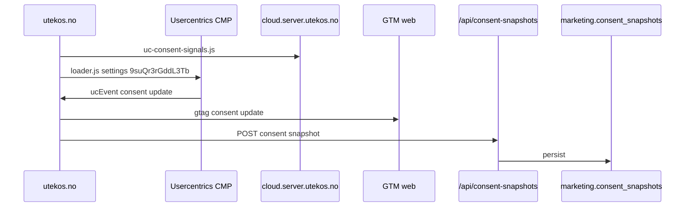
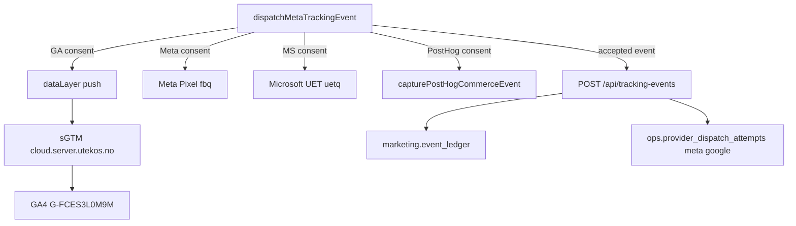
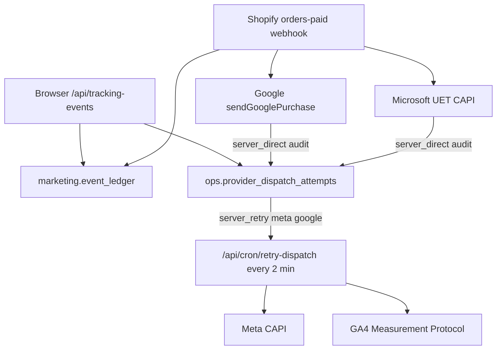
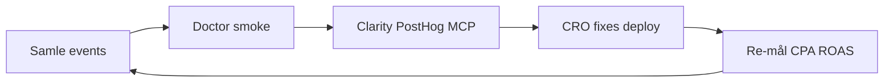
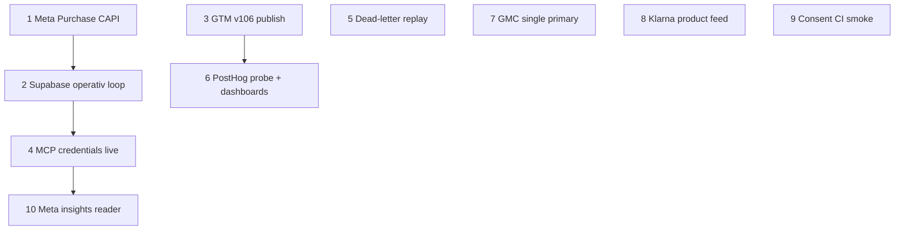

# FLOW — tracking, observability og analytics

Status date: 2026-07-07

Kanonisk oversikt over hvordan Utekos samler, leverer og bruker data for
annonsering, produktanalyse og drift. Les dette sammen med
[AGENTS.md](AGENTS.md), [PLAN.md](PLAN.md), [DEPLOYMENT.md](DEPLOYMENT.md) og
[src/lib/tracking/server-side-tagging.md](src/lib/tracking/server-side-tagging.md).

**Dokumentasjonsstatus:** Basert på kildekode, live
`npm run mcp:commerce-tracking:doctor` (2026-07-07), og verifiserte
subagent-kartlegginger. Live probe-status kan endre seg når `.env.mcp.local`
oppdateres — kjør doctor før operasjonelle beslutninger.

---

## 1. Formål og forretningskobling

### Overordnet mål

- Merkevarevekst for Utekos
- Flere kjøp av Utekos-produkter, hyppigere og til stadig lavere kostnad (CPA)
- Dyp innsikt i kundereisen: hva fungerer, hvor det friksjonerer, hvordan vi når
  riktige kunder

### Tre lag (innsamling → leveranse → bruk)

Hovedproblemet vi adresserer: *hendelser registreres, men glemmes å migreres,
publiseres eller brukes videre.* FLOW.md skiller eksplisitt:

| Lag | Hva | Eksempler |
| --- | --- | --- |
| **Innsamling** | Consent → browser/server → lager | Usercentrics, `dispatchMetaTrackingEvent`, `/api/tracking-events` |
| **Leveranse** | Provider dispatch, cron sync, GTM publish | Meta CAPI, GA4 MP, UET CAPI, Merchant API |
| **Bruk** | Hvem leser data og handler på den | Ads-plattformer, PostHog CRO, Clarity replay, MCP doctor, agenter |


### Kanonisk rollefordeling

| System | Rolle | Ikke brukt til |
| --- | --- | --- |
| **Supabase** (`hkoawfbomhnzupcsdggb`) | Kanonisk tracking-, audit- og provider-statuslager | Produkt-funnels, session replay |
| **PostHog** | Consent-gatet produktanalyse og replay | Finansiell/provider-audit |
| **GA4 + sGTM** | Web analytics, consent-gated browser transport | Kanonisk purchase-ledger |
| **Meta / Google Ads / Microsoft Ads** | Algoritme-inndata og attribusjon | Primær produktanalyse |
| **Microsoft Clarity** | Atferdsinnsikt (heatmaps, recordings) | Kanonisk ledger eller finans |
| **Sentry** | Feil og ytelse (server/edge primært) | Marketing attribusjon |
| **Usercentrics** | Consent-autoritet (fail-closed) | Event-lagring |

---

## 2. Consent-lag (Usercentrics)

### Faktisk flyt



**Kjernefiler:**

- [src/components/cookie-consent/UsercentricsScript.tsx](src/components/cookie-consent/UsercentricsScript.tsx) — CMP loader, Consent Mode v2 defaults (`denied`)
- [src/components/cookie-consent/UsercentricsConsentProvider.tsx](src/components/cookie-consent/UsercentricsConsentProvider.tsx) — `ucEvent`, `gtag('consent','update')`
- [src/components/cookie-consent/usercentricsConfig.ts](src/components/cookie-consent/usercentricsConfig.ts) — DPS-navn
- [src/app/api/consent-snapshots/route.ts](src/app/api/consent-snapshots/route.ts) — server persist

### DPS-tjenester og consentflate

| DPS-navn (Usercentrics) | Flate | Aktiverer |
| --- | --- | --- |
| Google Analytics | Statistics | dataLayer, GTM load |
| Google Ads | Marketing | GTM load (sammen med GA) |
| Facebook Pixel | Marketing | Meta Pixel |
| Microsoft Advertising Remarketing | Marketing | UET browser |
| Microsoft Clarity | Statistics | Clarity (via GTM/sGTM; ikke egen SDK i `src/`) |
| PostHog | Statistics | PostHog init |
| Vercel Analytics / Speed Insights | Statistics | Vercel telemetry |
| Sentry Replay | Statistics | **Ikke implementert** (navn finnes, ingen runtime) |
| Chatbase (legacy) | Marketing | Finnes i nåværende consent-gate, men skal ikke videreutvikles; ny AI-kundeassistent planlegges separat |
| Klarna On-site Messaging | Marketing | Klarna OSM WebSDK |

### Status og gap

| | Status |
| --- | --- |
| Consent fail-closed | Implementert |
| sGTM consent signals | Verifisert på `cloud.server.utekos.no` |
| Autoblocker | Bevisst **av** (bryter Next.js 16 RSC bootstrap) |
| Usercentrics Admin MCP | **Finnes ikke** — verifisering via `usercentricsConsentDiagnostics.test.ts`, `npm run tracking:smoke` |
| Server consent cookie | `ucConsentAllowedDps` lest av API-ruter |

**Forbedring:** Dedikert consent-smoke i CI; dokumentere eksakt DPS-label-match mot Usercentrics Admin ved hver tjenesteendring.

---

## 3. Browser-innsamlingshub

### Entry point

All commerce browser-tracking går via én hub:

[src/lib/tracking/meta/dispatchMetaTrackingEvent.ts](src/lib/tracking/meta/dispatchMetaTrackingEvent.ts)

### Parallelle utganger (consent-gated)



### Kanoniske commerce-events

| Canonical | Meta / Pixel | Google dataLayer | Microsoft UET | PostHog |
| --- | --- | --- | --- | --- |
| `page_view` | PageView | page_view | page_view | utekos_page_view |
| `view_item_list` | ViewContent | view_item_list | view_item_list | utekos_view_item_list |
| `select_item` | ViewContent | select_item | — | utekos_select_item |
| `view_item` | ViewContent | view_item | view_item | utekos_view_item |
| `add_to_cart` | AddToCart | add_to_cart | add_to_cart | utekos_add_to_cart |
| `begin_checkout` | InitiateCheckout | begin_checkout | begin_checkout | utekos_begin_checkout |
| `purchase` | Purchase | purchase | PRODUCT_PURCHASE | utekos_purchase |
| `search` | Search | search | — | utekos_search |
| `generate_lead` | Lead | generate_lead | — | utekos_generate_lead |

Kontrakt: Commerce Tracking MCP `tracking_event_contract` og
[types/tracking/event/index.ts](types/tracking/event/index.ts).

### Kallere

- [src/lib/tracking/client/trackAddToCart.ts](src/lib/tracking/client/trackAddToCart.ts)
- Produkt-/liste-komponenter, checkout, landing pages
- [src/components/analytics/GoogleAnalyticsPageTracker.tsx](src/components/analytics/GoogleAnalyticsPageTracker.tsx) — page views via dataLayer

---

## 4. Supabase — hva sendes og hvordan brukes det

### Prosjekt

- **Kanonisk:** `hkoawfbomhnzupcsdggb` (`supabase-pink-lens`, eu-north-1)
- **Legacy (ikke bruk):** `ycqwilkchurgsldeimdi`

### Tabeller som skrives til (live)

| Tabell | Schema | Kilde | Innhold |
| --- | --- | --- | --- |
| `event_ledger` | marketing | `/api/tracking-events`, Shopify `orders-paid` | Alle accepted events |
| `provider_dispatch_attempts` | ops | Browser queue + purchase audit | Provider dispatch/kø |
| `consent_snapshots` | marketing | `/api/consent-snapshots` | CMP-tilstand |
| `website_visitor_events` | marketing | `/api/analytics/visitor-event` | Sidebesøk |
| `attribution_events` | marketing | `/api/analytics/landing-attribution` | UTM/referrer |
| `web_vitals` | ops | `/api/analytics/web-vitals` | CWV |
| `campaign_insights` | marketing | cron `sync-meta-insights` | Meta spend/ROAS |
| `meta_quality_snapshots` | marketing | cron `sync-meta-insights` | Dataset quality |
| `integration_job_leases` | ops | cron `sync-google-merchant` | Merchant sync lease |
| `dead_letter_events` | ops | retry cron (etter 5 feil) | Uoppløste provider-feil |
| `event_ledger_archive` | analytics | pg_cron archive | Kald lagring |

### Tabeller schema-only (ingen app-writer funnet)

- `marketing.leads`
- `partner.sources`, `partner.referrals`
- `ops.integration_events`, `ops.slo_incidents`

### Provider dispatch-flyt



| `dispatch_mode` | Bruk | Providers |
| --- | --- | --- |
| `server_retry` | Browser events → cron retry | `meta`, `google` |
| `server_direct` | Purchase audit (ikke retry-kø) | `google`, `microsoft_uet` |
| `client_observed` | **Uimplementert** | — |

### Statuser og skip

- `skipped_unqualified` + `skip_reason=missing_client_id` — Google purchase uten `client_id` (ikke dead-letter)
- `dead_lettered` — etter 5 mislykkede retries
- Read models: `ops.provider_dispatch_health`, `ops.dead_letter_summary`

### Hvem leser data i dag?

| Leser | Bruk |
| --- | --- |
| [scripts/tracking/verify-commerce-event-flow.mjs](scripts/tracking/verify-commerce-event-flow.mjs) | E2E smoke (ledger + network) |
| [scripts/ops/provider-dispatch-feedback-report.mjs](scripts/ops/provider-dispatch-feedback-report.mjs) | Read-only operativ rapport på provider health + dead letters |
| pg_cron `archive_event_ledger_batch` | Kald arkivering |
| **Ingen app-dashboard** | — |
| **Ingen ekstern alert-kanal** | Lokal rapport kan feile på terskler med `--fail-on-alerts` |

### Kritiske gap (Supabase)

| Gap | Konsekvens |
| --- | --- |
| Data skrives, lite leses operativt | **Løst lokalt** — read-only rapport etablert; app-dashboard/ekstern alert-kanal gjenstår |
| `sendMetaPurchase` ikke på webhook | **Løst lokalt** — production deploy og Meta-verifikasjon gjenstår |
| Dead-letter replay ikke operasjonalisert | **Løst lokalt** — dry-run replay-plan og fail-closed replay-route guard etablert; production replay krever fortsatt eksplisitt godkjenning |
| Meta insights/quality i Supabase uten leser | Cron skriver, ingen dashboard |

**Kjernefiler:**

- [src/lib/tracking/warehouse/persistAcceptedTrackingEvent.ts](src/lib/tracking/warehouse/persistAcceptedTrackingEvent.ts)
- [src/lib/tracking/warehouse/recordProviderDispatchAttempt.ts](src/lib/tracking/warehouse/recordProviderDispatchAttempt.ts)
- [src/lib/tracking/warehouse/retryProviderDispatchAttempts.ts](src/lib/tracking/warehouse/retryProviderDispatchAttempts.ts)
- [src/lib/tracking/services/processOrderTrackingWithDependencies.ts](src/lib/tracking/services/processOrderTrackingWithDependencies.ts)

---

## 5. PostHog

### Flyt

```
Providers.tsx
  → DeferredTrackingServices (etter page settle)
    → DeferredTrackingBundle
      → PostHogClientProvider (consent-gated)
      → PostHogConsentGate (manuell $pageview)
```

### Hva sendes

| Event | Når | Egenskaper |
| --- | --- | --- |
| `$pageview` | Route change | `$current_url` = origin + pathname, uten query params eller fragment |
| `utekos_*` | Commerce actions | pathname only, ingen PII, ingen provider payloads |

### Hva sendes ikke (bevisst)

- Autocapture (`autocapture: false`)
- Auto pageview/pageleave
- PII, query-string secrets, free-text, provider payloads

### Innstillinger

- Host: `https://portal.utekos.no` (first-party)
- Replay: på med `maskAllInputs`, `maskTextSelector: '*'`, network URL redaction
- `person_profiles: 'identified_only'`

### Hvorfor og bruk

| Hvorfor | Bruk |
| --- | --- |
| Produktfunnels uten å forurense provider-audit | CRO, drop-off analyse |
| Session replay (maskert) | UX-feil, checkout-friksjon |
| Eksplisitte commerce-events | Sammenlign kanaler vs. Supabase ledger |

### Status og gap

| | Status |
| --- | --- |
| Consent-gating | Implementert |
| Commerce helper | [capturePostHogCommerceEvent.ts](src/lib/tracking/posthog/capturePostHogCommerceEvent.ts) |
| MCP probes | `posthog_*` — **fail-closed** (mangler `POSTHOG_PROJECT_ID`/API key i `.env.mcp.local`) |
| `$pageview` full URL | **Løst lokalt** — `PostHogConsentGate` sender origin + pathname uten query params eller fragment |

**Forbedring:** Ukentlig PostHog review-mal; UTM-segmentering i dashboards uten å lagre rå query params i pageview.

---

## 6. Google-stack

Komponenter: **GA4**, **GTM web**, **sGTM** (`cloud.server.utekos.no`), **Google Ads** (GA4-import, ikke native tags), **Merchant Center**, **GCP** (`project-c683eb2c-20ae-4ec2-ac3`).

Detaljert sGTM-runbook: [src/lib/tracking/server-side-tagging.md](src/lib/tracking/server-side-tagging.md).

### Browser-flyt

```
Consent (GA/Ads) → ConsentGatedGoogleTagManager
  → cloud.server.utekos.no/gtm.js?id=GTM-5TWMJQFP
  → sGTM (Cloud Run gtm-server)
  → GT-MKRLF5WK → GA4 G-FCES3L0M9M + Ads AW-18180376403
```

### Server-flyt

| Path | Når |
| --- | --- |
| sGTM eier browser | `GOOGLE_BROWSER_EVENT_TRANSPORT=sgtm` (prod) |
| GA4 MP fallback | Business events med consent + `client_id` → `server_retry` queue |
| GA4 MP direkte purchase | Shopify `orders-paid` webhook → `sendGooglePurchase` |
| Skip | Manglende `client_id` → `skipped_unqualified` |

### Google Merchant Center

| | Verdi |
| --- | --- |
| Account | `5806691920` |
| Produkter (API) | 16 varianter |
| Cron | `0 */6 * * *` → [syncCatalogToMerchantCenter](src/lib/google/merchant-center/sync/syncCatalogToMerchantCenter.ts) |
| Datakilder | API `Utekos API Primary (NO-no)` + AUTOFEED `utekos.no` (dual primary — risiko) |
| Microsoft MMC | GMC-import daglig 06:00 → store `50039313` |

### GTM publish-status

| | Status |
| --- | --- |
| Live web container | Versjon **103** (`Web: GA4 commerce trigger includes select_item + view_item_list`) |
| Trigger **122** | Live regex inkluderer `select_item`/`view_item_list` — read-only preflight 2026-07-07 |
| Workspace **106** | Trigger `122` har forventet regex; workspace status viser fortsatt én `updated` change |
| Native Google Ads conversion tags | Bevisst **utelatt** (dobbeltelling mot GA4-import) |

### Google MCP probe-status (live 2026-07-07)

| Probe | Live | Neste handling |
| --- | --- | --- |
| `gtm_sgtm_endpoint_status_probe` | Ja | Vedlikehold |
| `ga4_event_status_probe` | Ja | Verifiser property `489598217` forblir tilgjengelig |
| `merchant_center_status_probe` | Nei | Legg `GOOGLE_MERCHANT_*` i `.env.mcp.local`; `npm run merchant:preflight` fungerer via `.env.local` |
| `gtm_api_workspace_probe` | Nei | OAuth token + numeriske account/container IDs |
| `google_ads_account_access_probe` | Nei | Developer token + OAuth |
| `google_ads_campaign_performance_probe` | Nei | Samme |
| `google_ads_conversion_action_probe` | Nei | Samme |
| `google_ads_search_terms_probe` | Nei | Samme |

---

## 7. Meta

### Flyt

| Lag | Implementasjon |
| --- | --- |
| Browser | `MarketingPixels` → `MetaPixelEvents` → `fbq` + `eventID` |
| Server queue | `/api/tracking-events` → `server_retry` → cron → `sendMetaBrowserEvent` (CAPI) |
| Purchase webhook | Ledger + Meta CAPI **koblet lokalt** via `sendMetaPurchase`; production deploy/provider-verifikasjon gjenstår |
| Insights cron | `sync-meta-insights` → `campaign_insights`, `meta_quality_snapshots` |

### Hensikt

Maksimal event-kvalitet til Meta-algoritmen: deduplisering via `eventID`, CAPI
for browser events, dataset quality snapshots for diagnostikk.

### Status og gap

| | Status |
| --- | --- |
| Pixel + browser CAPI queue | Implementert |
| `meta_dataset_quality_probe` | **Live** (2026-07-07 doctor) |
| Purchase CAPI fra webhook | **Løst lokalt** — [sendMetaPurchase.ts](src/lib/tracking/meta/sendMetaPurchase.ts) koblet; production deploy/provider-verifikasjon gjenstår |
| Insights i Supabase | Skrives, ikke lest av app |
| Meta write MCP | Krever eksplisitt godkjenning per handling |

---

## 8. Microsoft

Aktive flater: **UET**, **Microsoft Ads**, **Merchant Center (Shopping)**, **Clarity**.

### UET browser

- Tag: `97247724` (`UtekosTag`)
- Consent: `Microsoft Advertising Remarketing`
- Events: commerce via `dispatchMicrosoftUetBrowserEvent` + `MicrosoftUetTag`
- Ads UI: **Innsikt aktivert** (ny UI; erstatter «Enable Clarity»-checkbox)

### UET Conversions API purchase

- Webhook → `sendMicrosoftUetPurchase` (`server_direct` audit + retrybar feil → `server_retry`)
- Microsoft auth (offisiell): **UET tagID + ApiToken** →
  `Authorization: Bearer <ApiToken>` på
  `https://capi.uet.microsoft.com/v1/{tagId}/events`
- Runtime: `resolveMicrosoftUetCapiApiToken` refresher OAuth og kaller
  `GetUetTagAuthKey` (kort cache, force refresh ved 401/403); env-alias er fallback
- Bootstrap: `npm run microsoft-ads:fetch-uet-auth-key`
- Alternativ: Microsoft Advertising UI → UET tag → **Use Conversions API**
- Prosjekt-env (samme token): `MICROSOFT_UET_CAPI_ACCESS_TOKEN`,
  `MICROSOFT_UET_CAPI_TOKEN`, `UTEKOS_MICROSOFT_UET_CAPI_TOKEN`,
  `MICROSOFT_ADS_UET_CAPI_TOKEN`
- **Ikke** `MICROSOFT_ADS_ACCESS_TOKEN` (OAuth Ads API)
- Krever også `msclkid` i checkout-attribusjon
- Skip: `missing_capi_token`, `missing_msclkid`, `not_configured`
- Dead-letter replay: `tracking:microsoft_uet` via
  `/api/cron/replay-dead-letter` (etter deploy)

| | Verdi |
| --- | --- |
| Customer ID | `254835341` |
| Account ID | `188365141` |
| Store ID | `50039313` |
| OAuth API | `santini91yt@gmail.com` (Microsoft) |
| Ads UI daglig | `kristoffer@utekos.no` (Google sign-in) |
| GMC-import | `Utekos GMC Import NO Daily`, 06:00, 16 produkter |

### Microsoft Clarity

| | Status |
| --- | --- |
| Prosjekt | `wupwleuv2e` |
| Innspilling | Live på `utekos.no` |
| MCP `microsoft_clarity_ads_status_probe` | **ready** |
| Advertising Dashboard ↔ Microsoft Ads | **Feiler** (begge e-poster) — workaround: Clarity-filtre (`utm_source=bing`, referrer) + MCP `list-session-recordings` |
| In-app Clarity SDK | Finnes ikke i `src/` — forventes via UET/GTM |

### Microsoft MCP probe-status (live 2026-07-07)

| Probe | Live |
| --- | --- |
| `microsoft_uet_endpoint_status_probe` | Ja |
| `microsoft_ads_auth_readiness_probe` | Ja |
| `microsoft_shopping_content_status_probe` | Ja |
| `microsoft_clarity_ads_status_probe` | Ja |
| `microsoft_ads_account_access_probe` | Nei |
| `microsoft_ads_campaign_status_probe` | Nei |
| `microsoft_ads_ad_insight_probe` | Nei |

---

## 9. Sentry, Vercel, Klarna

### Sentry

| | |
| --- | --- |
| **Sendes** | Server/edge exceptions, request errors, profiling (server) |
| **Sendes ikke** | Client traces (sample rate 0); client errors → `/api/log` beacon |
| **Bruk** | Produksjonsfeil, ytelsesregresjoner |
| **Gap** | Sentry Replay DPS-navn finnes, ikke implementert; MCP `sentry_issue_status_probe` fail-closed |

**Filer:** [src/instrumentation.ts](src/instrumentation.ts), [sentry.server.config.ts](sentry.server.config.ts), [src/app/global-error.tsx](src/app/global-error.tsx)

### Vercel

| | |
| --- | --- |
| **Rolle** | Hosting, cron (`vercel.json`), edge region `arn1` |
| **Crons** | `retry-dispatch` (*/2), `sync-google-merchant` (*/6), `sync-meta-insights` (05:00), `sync-catalog` (04:00) |
| **MCP** | `vercel_deployment_status_probe` — fail-closed uten token |

### Klarna — verne om (ikke fjern)

| Komponent | Status | Merknad |
| --- | --- | --- |
| Express Checkout (PDP) | **Implementert** | [KlarnaProductExpressCheckout](src/components/klarna/KlarnaProductExpressCheckout.tsx) |
| On-site Messaging | **Implementert** | PDP + `/handlehjelp/klarna` |
| OSM placements (home/footer/top-strip) | Bygget, **ikke importert** på alle sider | Utvidelsespotensial |
| Notifications webhook | Stub (log only) | [route.ts](src/app/api/klarna/notifications/route.ts) |
| Product feed for Klarna Ads | **Ikke implementert** | Kun referanse i draft |
| Purchase tracking | Kun GA4 dataLayer fra express fullført | Ikke Supabase/Meta/MS |

---

## 10. MCP og operativ innsikt

### Commerce Tracking MCP — 28 read-only tools

Kilde: [scripts/mcp/utekos-commerce-tracking-server.mjs](scripts/mcp/utekos-commerce-tracking-server.mjs)

Anbefalt flyt:

1. `commerce_tracking_bootstrap`
2. `provider_env_readiness`
3. `provider_access_remediation_report`
4. Målrettede `*_probe` per provider

### Verifikasjonskommandoer

```bash
npm run mcp:build && npm run mcp:doctor
npm run mcp:commerce-tracking:doctor
npm run tracking:smoke          # consent + GTM/sGTM nettverk
npm run tracking:commerce-smoke   # ledger + provider evidence
npm run merchant:preflight      # Google GMC (via .env.local)
```

### Live probe-matrise (2026-07-07)

| Provider | Implementert | Live verifisert | Fail-closed årsak | Neste handling |
| --- | --- | --- | --- | --- |
| Shopify Admin | Ja | Ja | — | Vedlikehold |
| Shopify Storefront | Ja | Ja | — | Vedlikehold |
| sGTM/GTM public | Ja | Ja | — | Vedlikehold |
| GA4 | Ja | Ja | — | Vedlikehold property-tilgang |
| Meta Dataset Quality | Ja | Ja | — | Roter token ved eksponering |
| Microsoft UET public | Ja | Ja | — | Vedlikehold |
| Microsoft Ads auth | Ja | Ja | — | Refresh token ved utløp |
| Microsoft Shopping | Ja | Ja | — | Verifiser produktantall etter GMC-sync |
| Microsoft Clarity config | Ja | Ja | — | Workaround for Ads Dashboard |
| Merchant Center MCP | Ja | Nei | `.env.mcp.local` merchant env | Synk env med `.env.local` |
| Google Ads (4 probes) | Ja | Nei | OAuth/dev token | Fullfør Google Ads OAuth |
| GTM API workspace | Ja | Nei | OAuth + numeric IDs | Reauth + publish v106 |
| PostHog | Ja | Nei | API key/project id | Legg til i `.env.mcp.local` |
| Sentry | Ja | Nei | Token scope | Utvid token |
| Vercel | Ja | Nei | `VERCEL_TOKEN` | Legg til token |
| Microsoft Ads account/campaign | Ja | Nei | Credential/scope | Verifiser CustomerId/AccountId |

**Doctor-sammendrag:** 4 verified live, 11 fail-closed (per `provider_access_remediation_report`).

---

## 11. Lukket operativ loop (mål)



| Steg | Verktøy | Status |
| --- | --- | --- |
| Samle | Browser + webhooks + crons | Implementert |
| Verifiser | `mcp:commerce-tracking:doctor`, smoke scripts | Delvis (mange probes fail-closed) |
| Analyser | Clarity MCP, PostHog, Meta insights (manuelt) | Clarity OK; PostHog MCP blocked |
| Handle | Deploy, GTM publish, provider fixes | Krever eksplisitt godkjenning ([DEPLOYMENT.md](DEPLOYMENT.md)) |
| Mål | Ads dashboards, Supabase views | Supabase views har lokal read-only rapport; app-dashboard gjenstår |

---

## 12. Gap-register (prioritert)

| P | Gap | Konsekvens | Anbefalt handling |
| --- | --- | --- | --- |
| **P0** | Meta Purchase CAPI ikke på webhook | **Løst lokalt** — production deploy og Meta-verifikasjon gjenstår | `sendMetaPurchase` er koblet i `processOrderTracking`; verifiser etter deploy |
| **P0** | Supabase data skrives, lite leses | **Løst lokalt** — operativ rapport; ingen ekstern alert-kanal | `npm run ops:provider-dispatch-report`; bruk `--fail-on-alerts` for lokal terskelalarm |
| **P0** | GTM commerce trigger preflight | Live v103 inneholder `select_item`/`view_item_list`; workspace 106 viser fortsatt én `updated` change | Ikke republiser uten eksplisitt godkjenning; verifiser Tag Assistant/GA4 Realtime |
| **P1** | Merchant/Google Ads MCP fail-closed | Agent mangler live Google Ads-innsikt | Synk `.env.mcp.local`; fullfør OAuth |
| **P1** | PostHog `$pageview` med full URL | Query-param lekkasje | **Løst lokalt:** origin + pathname uten query params eller fragment; verifiser PostHog capture etter deploy |
| **P1** | Clarity ↔ Microsoft Ads Dashboard | Ingen kampanje+replay i ett UI | Clarity-filtre + MCP; support-sak `clarityMS@microsoft.com` |
| **P1** | Klarna product feed | Blokkerer Klarna-annonsering | Implementer feed-generator |
| **P1** | GMC dual primary (API + AUTOFEED) | Forvirring Microsoft/Google import | Deaktiver AUTOFEED når API er kanonisk |
| **P2** | Sentry Replay ikke consent-koblet | Mangler client session-feildiagnostikk | Implementer etter Usercentrics DPS |
| **P2** | Schema-only tabeller | Forvirring om live status | Dokumenter eller implementer |
| **P2** | `client_observed` dispatch_mode | Ubrukt kontrakt | Implementer eller fjern fra schema |

---

## 13. Fremtidige integrasjoner og kandidater

| Integrasjon | Hensikt for merkevarevekst | Forutsetning | Status |
| --- | --- | --- | --- |
| **Ny AI-kundeassistent** (ikke legacy Chatbase) | Salg+support-innsikt, consent-gatet chat | PII-policy; ny bot/agent-kontrakt; koble til PostHog/Supabase attribution | **Planlagt**; legacy Chatbase skal ikke være fremtidig målflate |
| **Google Cloud genai** (10k NOK credit) | Agenter som analyserer ledger, Clarity, Merchant data | GCP `project-c683eb2c-20ae-4ec2-ac3`; read-only først | **Planlagt** |
| **LangChain / LangSmith** | Evaluering og sporbarhet for agenter | Stabile datakontrakter fra denne FLOW | **Vurderes** |
| **Docker MCP** | Dypere multi-plattform observability | Ikke erstatte Supabase som kanonisk lager | Delvis (`docker-mcp-*` i MCP) |
| **Workflow SDK v5** | Durable orchestration for retry/replay, smoke, reports og post-deploy verification | Next.js config wrapper, Vercel Fluid Compute, idempotency-kontrakter, pilot uten provider writes | **Vurdert, ikke installert** |
| **Shopify for Vercel** | Forenkle eksisterende Shopify store-linking og Vercel env management | Eksplisitt godkjenning; eksisterende shop må kobles uten catalog/theme-mutasjoner | **Vurdert, ikke installert** |

### Ny AI-kundeassistent — hensikt (forslag)

1. Consent-gatet chat med ny bot/agent, ikke videreutvikling av legacy Chatbase
2. Logg intents/kategorier til PostHog (uten PII) → produkt-CRO
3. Koble høy-intent sessions til Clarity replay (manuell review)
4. Fremtidig: genai-agent som foreslår FAQ/produktcopy basert på chat-mønstre

### Workflow SDK og Shopify for Vercel — vurderingsstatus

- Workflow SDK v5 er relevant for operasjonelle, idempotente arbeidsflyter:
  provider retry/dead-letter replay, ukentlige analytics-rapporter, Merchant
  sync-orkestrering, tracking-smoke/remediation og post-deploy-verifikasjon.
  Det er ikke installert fordi v5-dokumentasjonen er pre-release og
  provider-/production-mutasjoner krever eksplisitt godkjenning.
- Shopify for Vercel er relevant som Vercel Marketplace-kobling for
  eksisterende Shopify shop og automatisk env-provisjonering. Det erstatter
  ikke Utekos sin eksisterende custom headless Shopify-integrasjon og er ikke
  installert uten eksplisitt godkjenning.

### Google genai-agenter (forslag)

1. Read-only agent mot Supabase views (`provider_dispatch_health`, `dead_letter_summary`)
2. Ukentlig rapport: gap-trender, provider skip-rate, anbefalte fixes
3. **Ikke** auto-mutere campaigns/budget uten eksplisitt godkjenning

---

## 14. Verifiserte påstander (kilde-ettersjekk 2026-07-07)

| Påstand | Verifisert i |
| --- | --- |
| `sendMetaPurchase` på webhook | [processOrderTrackingWithDependencies.ts](src/lib/tracking/services/processOrderTrackingWithDependencies.ts) — meta + google + microsoft_uet `server_direct` audit lokalt |
| Google skip `missing_client_id` | Samme fil L90, L141; [recordProviderDispatchAttempt.ts](src/lib/tracking/warehouse/recordProviderDispatchAttempt.ts) |
| PostHog `autocapture: false` | [PostHogProvider.tsx](src/components/providers/PostHogProvider.tsx) L46 |
| Browser hub fan-out | [dispatchMetaTrackingEvent.ts](src/lib/tracking/meta/dispatchMetaTrackingEvent.ts) |
| Retry cron hvert 2. min | [vercel.json](vercel.json) |
| Merchant sync hvert 6. time | [vercel.json](vercel.json) |

---

## 15. Relaterte dokumenter

| Dokument | Innhold |
| --- | --- |
| [AGENTS.md](AGENTS.md) | Operativ kontrakt |
| [PLAN.md](PLAN.md) | Status og beslutninger |
| [DEPLOYMENT.md](DEPLOYMENT.md) | Release-gates |
| [src/lib/tracking/server-side-tagging.md](src/lib/tracking/server-side-tagging.md) | sGTM detaljer |
| [docs/agent-context-map.md](docs/agent-context-map.md) | Agent navigasjon |
| [config/mcp/README.md](config/mcp/README.md) | MCP oppsett |

---

## 16. Topp 10 — første endringer og oppgraderinger

Handlingsprioritert liste som syntetiserer gapene i §12 til konkrete første steg.
Rangert etter forretningspåvirkning: merkevarevekst, flere kjøp, lavere CPA, og
lukket innsamling → leveranse → bruk-løkke.



### 1. Koble `sendMetaPurchase` på Shopify `orders-paid` webhook

| | |
| --- | --- |
| **Hvorfor** | Meta-algoritmen mangler server-side purchase. Browser CAPI-kø dekker ikke webhook-kjøp. Maksimal datakvalitet til Meta (70 % paid media). |
| **Gap i dag** | **Løst lokalt** — `sendMetaPurchase` er koblet i [`processOrderTrackingWithDependencies.ts`](src/lib/tracking/services/processOrderTrackingWithDependencies.ts); production deploy og provider-verifikasjon gjenstår. |
| **Handling** | Ferdig lokalt: `sendMetaPurchase` kjøres fra Shopify `orders-paid` når checkout-attribusjon finnes, og audit skrives via `recordProviderDispatchAttempt` (`server_direct`). |
| **Godkjenning** | Ingen provider-skriving utover eksisterende CAPI-kontrakt; deploy etter [DEPLOYMENT.md](DEPLOYMENT.md). |
| **Verifikasjon** | `npm run tracking:commerce-smoke`; Meta Events Manager dedup med `event_id`; `meta_dataset_quality_probe`. |

### 2. Etabler operativ Supabase feedback-loop (dashboard + alerting)

| | |
| --- | --- |
| **Hvorfor** | Data skrives til `event_ledger`, `provider_dispatch_attempts`, `dead_letter_events` — men ingen leser dem operativt. Lukker «registrert men glemt»-problemet. |
| **Gap i dag** | **Løst lokalt** — views finnes (`ops.provider_dispatch_health`, `ops.dead_letter_summary`) og [`provider-dispatch-feedback-report.mjs`](scripts/ops/provider-dispatch-feedback-report.mjs) gir operativ rapport + terskelalarm; app-dashboard og ekstern alert-kanal gjenstår. |
| **Handling** | Kjør `npm run ops:provider-dispatch-report` for read-only rapport over kødybde, skip-rate per provider og unresolved dead letters. Bruk `-- --fail-on-alerts` eller `OPS_PROVIDER_DISPATCH_FAIL_ON_ALERTS=1` når rapporten skal gi non-zero alert-exit. |
| **Godkjenning** | Supabase read-only views krever ingen schema-mutasjon; alerting-kanaler krever eksplisitt valg. |
| **Verifikasjon** | `node --test scripts/ops/provider-dispatch-feedback-report.test.mjs`; read-only SQL mot views via rapportscript når warehouse-env er tilgjengelig. |

### 3. Verifiser GTM commerce trigger live

| | |
| --- | --- |
| **Hvorfor** | `select_item` / `view_item_list` må fyre i live GTM for Google Shopping/liste-innsikt. |
| **Gap i dag** | Read-only preflight 2026-07-07 viser at live v103 allerede inneholder forventet regex, men workspace 106 viser fortsatt én `updated` change på trigger `122`. |
| **Handling** | Ikke republiser uten separat godkjenning. Reconcile workspace 106 og verifiser live-firing med Tag Assistant/GA4 Realtime. |
| **Godkjenning** | **GTM publish krever fortsatt eksplisitt brukergodkjenning** før handling. |
| **Verifikasjon** | Live `/gtm.js?id=GTM-5TWMJQFP` returnerer v103 med forventet regex; GA4 Realtime for `select_item`/`view_item_list`; `ga4_event_status_probe`. |

### 4. Synk `.env.mcp.local` og åpne fail-closed MCP probes

| | |
| --- | --- |
| **Hvorfor** | 11 av 28 commerce-tracking probes er fail-closed — agenter mangler live innsikt i Google Ads, Merchant, PostHog, Sentry, Vercel. |
| **Gap i dag** | §10 — doctor viser 4 verified live, 11 fail-closed. |
| **Handling** | Lokal template/manifest er synket slik at `.env.mcp.example` nå viser probe-nøklene uten hemmelige verdier. Neste manuelle steg: fyll `.env.mcp.local` med `GOOGLE_MERCHANT_ACCOUNT_ID` + `GOOGLE_MERCHANT_QUOTA_PROJECT`, Google Ads developer token + read-token (`GOOGLE_ADS_ACCESS_TOKEN` eller `GOOGLE_ADS_OAUTH_ACCESS_TOKEN`) + `GOOGLE_ADS_CUSTOMER_ID`, `POSTHOG_PROJECT_ID` + `POSTHOG_PERSONAL_API_KEY`/`POSTHOG_CUSTOM_API_KEY`, `SENTRY_AUTH_TOKEN` + `SENTRY_ORG` + `SENTRY_PROJECT`, `VERCEL_TOKEN` + `VERCEL_PROJECT_ID`, og `GTM_ACCESS_TOKEN`/`GOOGLE_TAG_MANAGER_ACCESS_TOKEN` + numeriske `GTM_ACCOUNT_ID`/`GTM_CONTAINER_ID`. Kjør deretter `npm run mcp:build && npm run mcp:doctor`. |
| **Godkjenning** | Kun credential-synk; ingen provider-mutasjon. |
| **Verifikasjon** | `npm run mcp:commerce-tracking:doctor` — mål: ≥ 15 live probes. |

### 5. Operasjonaliser dead-letter replay

| | |
| --- | --- |
| **Hvorfor** | Etter 5 retries → `dead_letter_events` uten replay-verktøy. Tapte konverteringer for Meta/Google. |
| **Gap i dag** | **Løst lokalt** — [`dead-letter-replay-plan.mjs`](scripts/ops/dead-letter-replay-plan.mjs) klassifiserer unresolved dead letters read-only, og `/api/cron/replay-dead-letter` er fail-closed bak `CRON_SECRET` + `DEAD_LETTER_REPLAY_ENABLED=1`. |
| **Handling** | Kjør `npm run ops:dead-letter-replay-plan` først. Reparer rader klassifisert som `requires_attribution_repair`, `invalid_metadata`, `attempt_not_found`, `provider_mismatch`, `non_retry_dispatch_mode` eller `non_dead_letter_attempt_status`; replay kun `eligible_requeue`. |
| **Godkjenning** | Replay er provider-dispatch og Supabase-mutasjon. Før første production run må bruker eksplisitt godkjenne: «Approve one production dead-letter replay run for N eligible row(s) by enabling `DEAD_LETTER_REPLAY_ENABLED=1` and invoking `/api/cron/replay-dead-letter` with `CRON_SECRET`?» |
| **Verifikasjon** | `node --test scripts/ops/dead-letter-replay-plan.test.mjs`; `node --import tsx --test src/lib/tracking/warehouse/replayDeadLetterEvents.test.ts src/lib/tracking/warehouse/isDeadLetterReplayEnabled.test.ts`; etter godkjent deploy: route uten env gir `403`, uten secret gir `401`, planrapport viser bare godkjente `eligible_requeue`, og `ops.dead_letter_summary` trender ned etter replay. |

### 6. Fiks PostHog MCP probe + etabler CRO-dashboards

| | |
| --- | --- |
| **Hvorfor** | App sender `utekos_*` og `$pageview`; `posthog_event_status_probe` søker kanoniske navn (`page_view`, `add_to_cart`) — gir falsk «ingen data». PostHog er underutnyttet for funnels/replay. |
| **Gap i dag** | §5 P1 — probe-query mismatch; ingen etablerte CRO-dashboards. |
| **Handling** | Fiks HogQL i [`utekos-commerce-tracking-server.mjs`](scripts/mcp/utekos-commerce-tracking-server.mjs) til `utekos_${canonical}` + `$pageview`. Bygg PostHog-dashboards: checkout-funnel, UTM-segmentering (via landing-attribution, ikke rå query i pageview). |
| **Godkjenning** | Probe-fiks er kode; dashboards er read-only i PostHog. |
| **Verifikasjon** | `posthog_event_status_probe` med `observed: true`; manuell funnel-review i PostHog UI. |

### 7. Konsolider Google Merchant Center (én kanonisk datakilde)

| | |
| --- | --- |
| **Hvorfor** | Dual primary: API `Utekos API Primary` + AUTOFEED `utekos.no` — forvirrer Microsoft GMC-import og produktantall. |
| **Gap i dag** | §6 P1, §8 — 16 API-produkter vs. import-tall kan avvike. |
| **Handling** | Verifiser API-sync via [`syncCatalogToMerchantCenter`](src/lib/google/merchant-center/sync/syncCatalogToMerchantCenter.ts). Deaktiver AUTOFEED i Merchant Center når API er kanonisk. `npm run merchant:preflight`. |
| **Godkjenning** | **Krever eksplisitt godkjenning** for Merchant Center-konfigurasjonsendring. |
| **Verifikasjon** | `merchant_center_status_probe`; `microsoft_shopping_content_status_probe` produktantall. |

### 8. Implementer Klarna product feed

| | |
| --- | --- |
| **Hvorfor** | Blokkerer Klarna-annonsering og utvidet Klarna Ads-bruk. |
| **Gap i dag** | §9 P1 — kun referanse i [`draft.md`](draft.md); feed ikke implementert. |
| **Handling** | Bygg produktfeed-generator fra Shopify-katalog (samme kilde som GMC). Publiser på stabil URL. Gradvis utvid OSM-plasseringer etter feed er live. |
| **Godkjenning** | Feed-publisering krever godkjenning; se Klarna-verneavsnitt under. |
| **Verifikasjon** | Klarna feed-validering; eksisterende Express Checkout og OSM fortsatt grønn. |

### 9. Consent-smoke i CI + dedikert consent-diagnostikk

| | |
| --- | --- |
| **Hvorfor** | Usercentrics har ingen Admin MCP. Fail-closed consent er fundament for all sporingsdata — feil her undergraver alt annet. |
| **Gap i dag** | §2 — kun unit test + manuell `npm run tracking:smoke`. |
| **Handling** | Legg `npm run tracking:smoke` i CI etter deploy-preview. Vurder `usercentrics_dps_inventory_probe` i commerce MCP. Dokumenter DPS-label-match ved hver tjenesteendring. |
| **Godkjenning** | CI-endring krever ingen provider-mutasjon. |
| **Verifikasjon** | `usercentricsConsentDiagnostics.test.ts` grønn; smoke grønn mot preview/prod. |

### 10. Les og bruk Meta insights/quality fra Supabase

| | |
| --- | --- |
| **Hvorfor** | Cron `sync-meta-insights` skriver `campaign_insights` + `meta_quality_snapshots` — ingen consumer. Kobler annonsekvalitet (events + annonser + optimalisering) til beslutninger. |
| **Gap i dag** | §7 — cron skriver, app leser ikke. Meta-innsikt delt i tre: event-kvalitet, annonsekvalitet, styringsinnsikt. |
| **Handling** | Bygg read-only leser (dashboard eller ukentlig rapport) mot `marketing.campaign_insights` og `marketing.meta_quality_snapshots`. Fremtidig: genai-agent (§13) — **ikke** auto-mutere campaigns uten godkjenning. |
| **Godkjenning** | Read-only først; campaign/budget-endringer krever eksplisitt godkjenning per handling. |
| **Verifikasjon** | SQL-spørring mot snapshots; sammenlign med Meta Ads UI og `meta_dataset_quality_probe`. |

### Klarna — verne om eksisterende implementasjon

Følgende skal **ikke fjernes eller refaktoreres** i disse 10 endringene:

| Komponent | Fil |
| --- | --- |
| Express Checkout (PDP) | [`KlarnaProductExpressCheckout.tsx`](src/components/klarna/KlarnaProductExpressCheckout.tsx) |
| On-site Messaging | PDP + `/handlehjelp/klarna` |
| Consent-gate | `Klarna On-site Messaging` DPS i Usercentrics |
| Notifications webhook | [`/api/klarna/notifications`](src/app/api/klarna/notifications/route.ts) |

Punkt 8 (product feed) er **additivt** — det utvider Kanal, ikke erstatter checkout/OSM.

### Bevisst utelatt fra topp 10

Disse hører i §13 (fremtidige integrasjoner), ikke som første endringer:

- Ny AI-kundeassistent (ikke legacy Chatbase)
- Google genai-agenter (10k GCP credit)
- LangChain / LangSmith
- Workflow SDK v5
- Sentry Replay consent-kobling (P2)
- `client_observed` dispatch_mode (P2)

### Kobling til overordnet mål

| Mål | Relevante punkter |
| --- | --- |
| Flere kjøp / lavere CPA | 1, 3, 5, 7, 8 |
| Dyp kundereise-innsikt | 2, 6, 9, 10 |
| Agent/MCP-drevet optimalisering | 4, 2, 10 |

---

## Endringslogg

| Dato | Endring |
| --- | --- |
| 2026-07-07 | GTM read-only preflight: live v103 har `select_item`/`view_item_list`; ingen publish utført |
| 2026-07-07 | Løst lokalt: dead-letter replay operasjonalisert med dry-run plan og fail-closed route guard |
| 2026-07-07 | §16 punkt 4 lokal MCP env-template/manifest synket for fail-closed probes; manuell secret-sync gjenstår |
| 2026-07-07 | §16 Topp 10 prioriterte endringer |
| 2026-07-07 | Løst lokalt: Supabase operativ feedback-loop via read-only provider dispatch rapport |
| 2026-07-07 | Løst lokalt: Meta Purchase CAPI koblet på Shopify `orders-paid` webhook |
| 2026-07-07 | Første versjon — full kartlegging tracking/observability/analytics |
