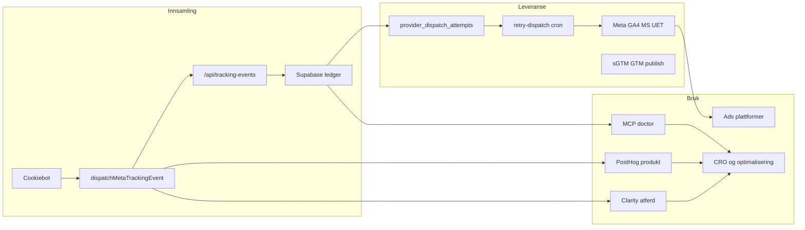
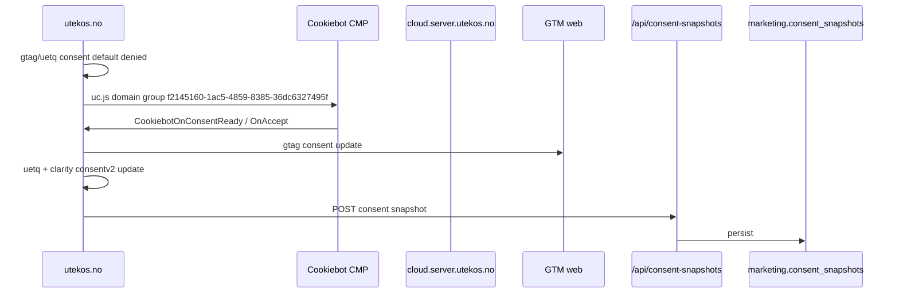
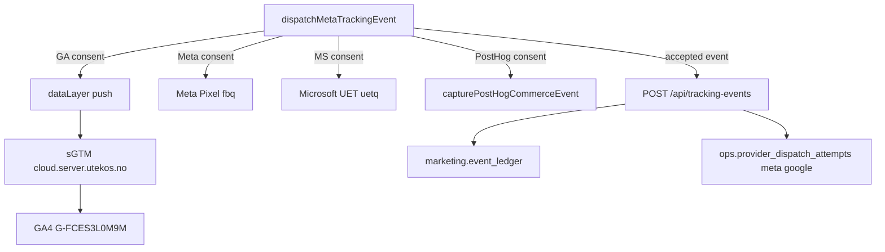
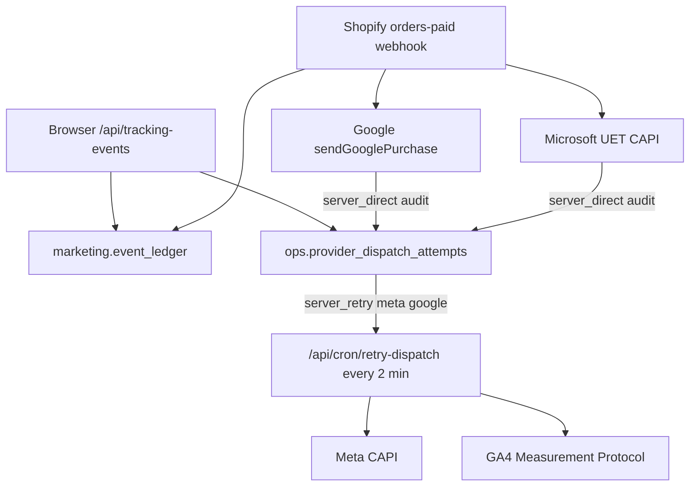
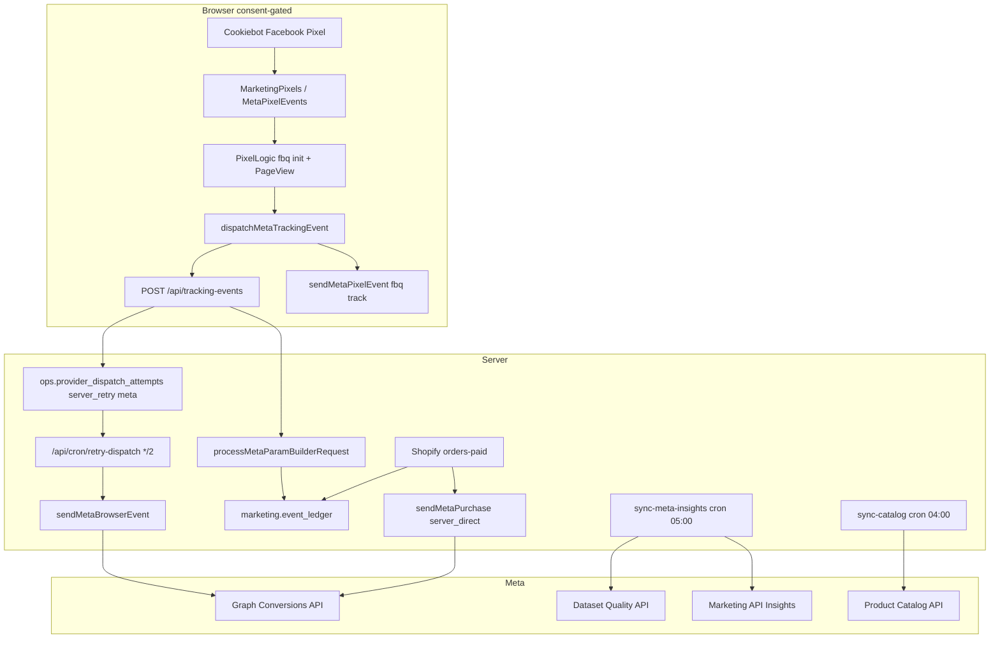
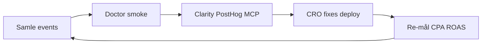

# FLOW — tracking, observability og analytics

Status date: 2026-07-08

Kanonisk oversikt over hvordan Utekos samler, leverer og bruker data for
annonsering, produktanalyse og drift. Les dette sammen med
[AGENTS.md](AGENTS.md), [PLAN.md](PLAN.md), [DEPLOYMENT.md](DEPLOYMENT.md) og
[src/lib/tracking/server-side-tagging.md](src/lib/tracking/server-side-tagging.md).

**Dokumentasjonsstatus:** Oppdatert 2026-07-08 for Cookiebot CMP-migrering.
Lokal verifisering: `cookiebotConsent.test.ts` grønn, `tracking:smoke` grønn mot
`localhost:3000` (med `NEXT_PUBLIC_ENABLE_GTM_IN_DEV=1`). Produksjon (`utekos.no`)
kjører fortsatt gammel Usercentrics-runtime til Cookiebot-endringene er deployet.
Supabase warehouse mottar events (siste 7 dager verifisert); `consent_snapshots`
viser `cookiebot` fra lokal smoke og `usercentrics` fra produksjon.

---

## 1. Formål og forretningskobling

### Overordnet mål

- Merkevarevekst for Utekos
- Flere kjøp av Utekos-produkter, hyppigere og til stadig lavere kostnad (CPA)
- Dyp innsikt i kundereisen: hva fungerer, hvor det friksjonerer, hvordan vi når
  riktige kunder

### Tre lag (innsamling → leveranse → bruk)

Hovedproblemet vi adresserer: *hendelser registreres, men glemmes å migreres,
publiseres eller brukes videre.* FLOW.md skiller eksplisitt:

| Lag | Hva | Eksempler |
| --- | --- | --- |
| **Innsamling** | Consent → browser/server → lager | Cookiebot, `dispatchMetaTrackingEvent`, `/api/tracking-events` |
| **Leveranse** | Provider dispatch, cron sync, GTM publish | Meta CAPI, GA4 MP, UET CAPI, Merchant API |
| **Bruk** | Hvem leser data og handler på den | Ads-plattformer, PostHog CRO, Clarity replay, MCP doctor, agenter |



### Kanonisk rollefordeling

| System | Rolle | Ikke brukt til |
| --- | --- | --- |
| **Supabase** (`hkoawfbomhnzupcsdggb`) | Kanonisk tracking-, audit- og provider-statuslager | Produkt-funnels, session replay |
| **PostHog** | Consent-gatet produktanalyse og replay | Finansiell/provider-audit |
| **GA4 + sGTM** | Web analytics, consent-gated browser transport | Kanonisk purchase-ledger |
| **Meta / Google Ads / Microsoft Ads** | Algoritme-inndata og attribusjon | Primær produktanalyse |
| **Microsoft Clarity** | Atferdsinnsikt (heatmaps, recordings) | Kanonisk ledger eller finans |
| **Sentry** | Feil og ytelse (server/edge primært) | Marketing attribusjon |
| **Cookiebot** | Consent-autoritet (fail-closed) | Event-lagring |

---

## 2. Consent-lag (Cookiebot)

### Faktisk flyt



**Kjernefiler:**

- [src/components/layout/CookieScript.tsx](src/components/layout/CookieScript.tsx) — Consent Mode v2 defaults (`denied`) + Cookiebot `uc.js` (`data-blockingmode="auto"`)
- [src/components/cookie-consent/CookiebotConsentProvider.tsx](src/components/cookie-consent/CookiebotConsentProvider.tsx) — `CookiebotOnAccept`, `gtag('consent','update')`, `uetq`, `clarity('consentv2')`
- [src/components/cookie-consent/cookiebotConfig.ts](src/components/cookie-consent/cookiebotConfig.ts) — domain group ID og tjenestenavn
- [src/components/cookie-consent/parseCookiebotConsentCookie.ts](src/components/cookie-consent/parseCookiebotConsentCookie.ts) — server-side parsing av `CookieConsent`
- [src/app/api/consent-snapshots/route.ts](src/app/api/consent-snapshots/route.ts) — server persist

### Tjenester og consentflate

| Tjenestenavn (Cookiebot) | Kategori | Aktiverer |
| --- | --- | --- |
| Google Analytics | Statistics | dataLayer, GA pageview |
| Google Ads | Marketing | GTM (sammen med GA via Consent Initialisation) |
| Facebook Pixel | Marketing | Meta Pixel |
| Microsoft Advertising Remarketing | Marketing | UET browser-events |
| Microsoft Clarity | Statistics | Clarity (via GTM/sGTM + `consentv2`) |
| PostHog | Statistics | PostHog init |
| Vercel Analytics / Speed Insights | Statistics | Vercel telemetry |
| Sentry Replay | Statistics | **Ikke implementert** (navn finnes, ingen runtime) |
| Chatbase (legacy) | Preferences | Finnes i consent-gate, men skal ikke videreutvikles; ny AI-kundeassistent planlegges separat |
| Klarna On-site Messaging | Marketing | Klarna OSM WebSDK |

### Status og gap

| | Status |
| --- | --- |
| Consent fail-closed | Implementert |
| sGTM endepunkter | Verifisert på `cloud.server.utekos.no` |
| Cookiebot auto-blocking | Aktiv (`data-blockingmode="auto"`) |
| GTM React-consent-gate | Fjernet — GTM lastes etter page-settle; Consent Initialisation i GTM |
| Server consent cookie | `CookieConsent` lest av API-ruter |
| sGTM env | `NEXT_PUBLIC_TRACKING_SGTM_ORIGIN=https://cloud.server.utekos.no` (hostname-only OK) |
| Verifisering | `cookiebotConsent.test.ts`, `npm run tracking:smoke`, `npm run tracking:commerce-smoke` |

**Forbedring:** Dedikert consent-smoke i CI; dokumentere eksakt tjenestenavn-match mot Cookiebot Admin ved hver tjenesteendring.

---

## 3. Browser-innsamlingshub

### Entry point

All commerce browser-tracking går via én hub:

[src/lib/tracking/meta/dispatchMetaTrackingEvent.ts](src/lib/tracking/meta/dispatchMetaTrackingEvent.ts)

### Parallelle utganger (consent-gated)



### Kanoniske commerce-events

| Canonical | Meta / Pixel | Google dataLayer | Microsoft UET | PostHog |
| --- | --- | --- | --- | --- |
| `page_view` | PageView | page_view | page_view | utekos_page_view |
| `view_item_list` | ViewContent | view_item_list | view_item_list | utekos_view_item_list |
| `select_item` | ViewContent | select_item | — | utekos_select_item |
| `view_item` | ViewContent | view_item | view_item | utekos_view_item |
| `add_to_cart` | AddToCart | add_to_cart | add_to_cart | utekos_add_to_cart |
| `begin_checkout` | InitiateCheckout | begin_checkout | begin_checkout | utekos_begin_checkout |
| `purchase` | Purchase | purchase | PRODUCT_PURCHASE | utekos_purchase |
| `search` | Search | search | — | utekos_search |
| `generate_lead` | Lead | generate_lead | — | utekos_generate_lead |

Kontrakt: Commerce Tracking MCP `tracking_event_contract` og
[types/tracking/event/index.ts](types/tracking/event/index.ts).

### Kallere

- [src/lib/tracking/client/trackAddToCart.ts](src/lib/tracking/client/trackAddToCart.ts)
- Produkt-/liste-komponenter, checkout, landing pages
- [src/components/analytics/GoogleAnalyticsPageTracker.tsx](src/components/analytics/GoogleAnalyticsPageTracker.tsx) — page views via dataLayer

---

## 4. Supabase — hva sendes og hvordan brukes det

### Prosjekt

- **Kanonisk:** `hkoawfbomhnzupcsdggb` (`supabase-pink-lens`, eu-north-1)
- **Legacy (ikke bruk):** `ycqwilkchurgsldeimdi`

### Tabeller som skrives til (live)

| Tabell | Schema | Kilde | Innhold |
| --- | --- | --- | --- |
| `event_ledger` | marketing | `/api/tracking-events`, Shopify `orders-paid` | Alle accepted events |
| `provider_dispatch_attempts` | ops | Browser queue + purchase audit | Provider dispatch/kø |
| `consent_snapshots` | marketing | `/api/consent-snapshots` | CMP-tilstand |
| `website_visitor_events` | marketing | `/api/analytics/visitor-event` | Sidebesøk |
| `attribution_events` | marketing | `/api/analytics/landing-attribution` | UTM/referrer |
| `web_vitals` | ops | `/api/analytics/web-vitals` | CWV |
| `campaign_insights` | marketing | cron `sync-meta-insights` | Meta spend/ROAS |
| `meta_quality_snapshots` | marketing | cron `sync-meta-insights` | Dataset quality |
| `integration_job_leases` | ops | cron `sync-google-merchant` | Merchant sync lease |
| `dead_letter_events` | ops | retry cron (etter 5 feil) | Uoppløste provider-feil |
| `event_ledger_archive` | analytics | pg_cron archive | Kald lagring |

### Tabeller schema-only (ingen app-writer funnet)

- `marketing.leads`
- `partner.sources`, `partner.referrals`
- `ops.integration_events`, `ops.slo_incidents`

### Provider dispatch-flyt



| `dispatch_mode` | Bruk | Providers |
| --- | --- | --- |
| `server_retry` | Browser events → cron retry | `meta`, `google` |
| `server_direct` | Purchase audit (ikke retry-kø) | `google`, `microsoft_uet` |
| `client_observed` | **Uimplementert** | — |

### Statuser og skip

- `skipped_unqualified` + `skip_reason=missing_client_id` — Google purchase uten `client_id` (ikke dead-letter)
- `dead_lettered` — etter 5 mislykkede retries
- Read models: `ops.provider_dispatch_health`, `ops.dead_letter_summary`

### Hvem leser data i dag?

| Leser | Bruk |
| --- | --- |
| [scripts/tracking/verify-commerce-event-flow.mjs](scripts/tracking/verify-commerce-event-flow.mjs) | E2E smoke (ledger + network) |
| [scripts/ops/provider-dispatch-feedback-report.mjs](scripts/ops/provider-dispatch-feedback-report.mjs) | Read-only operativ rapport på provider health + dead letters |
| pg_cron `archive_event_ledger_batch` | Kald arkivering |
| **Ingen app-dashboard** | — |
| **Ingen ekstern alert-kanal** | Lokal rapport kan feile på terskler med `--fail-on-alerts` |

### Kritiske gap (Supabase)

| Gap | Konsekvens |
| --- | --- |
| Data skrives, lite leses operativt | **Løst lokalt** — read-only rapport etablert; app-dashboard/ekstern alert-kanal gjenstår |
| `sendMetaPurchase` ikke på webhook | **Løst lokalt** — production deploy og Meta-verifikasjon gjenstår |
| Dead-letter replay ikke operasjonalisert | **Løst lokalt** — dry-run replay-plan og fail-closed replay-route guard etablert; production replay krever fortsatt eksplisitt godkjenning |
| Meta insights/quality i Supabase uten leser | Cron skriver, ingen dashboard |

**Kjernefiler:**

- [src/lib/tracking/warehouse/persistAcceptedTrackingEvent.ts](src/lib/tracking/warehouse/persistAcceptedTrackingEvent.ts)
- [src/lib/tracking/warehouse/recordProviderDispatchAttempt.ts](src/lib/tracking/warehouse/recordProviderDispatchAttempt.ts)
- [src/lib/tracking/warehouse/retryProviderDispatchAttempts.ts](src/lib/tracking/warehouse/retryProviderDispatchAttempts.ts)
- [src/lib/tracking/services/processOrderTrackingWithDependencies.ts](src/lib/tracking/services/processOrderTrackingWithDependencies.ts)

---

## 5. PostHog

### Flyt

```
Providers.tsx
  → DeferredTrackingServices (etter page settle)
    → DeferredTrackingBundle
      → PostHogClientProvider (consent-gated)
      → PostHogConsentGate (manuell $pageview)
```

### Hva sendes

| Event | Når | Egenskaper |
| --- | --- | --- |
| `$pageview` | Route change | `$current_url` = origin + pathname, uten query params eller fragment |
| `utekos_*` | Commerce actions | pathname only, ingen PII, ingen provider payloads |

### Hva sendes ikke (bevisst)

- Autocapture (`autocapture: false`)
- Auto pageview/pageleave
- PII, query-string secrets, free-text, provider payloads

### Innstillinger

- Host: `https://portal.utekos.no` (first-party)
- Replay: på med `maskAllInputs`, `maskTextSelector: '*'`, network URL redaction
- `person_profiles: 'identified_only'`

### Hvorfor og bruk

| Hvorfor | Bruk |
| --- | --- |
| Produktfunnels uten å forurense provider-audit | CRO, drop-off analyse |
| Session replay (maskert) | UX-feil, checkout-friksjon |
| Eksplisitte commerce-events | Sammenlign kanaler vs. Supabase ledger |

### Status og gap

| | Status |
| --- | --- |
| Consent-gating | Implementert |
| Commerce helper | [capturePostHogCommerceEvent.ts](src/lib/tracking/posthog/capturePostHogCommerceEvent.ts) |
| MCP probes | `posthog_*` — **fail-closed** (mangler `POSTHOG_PROJECT_ID`/API key i `.env.mcp.local`) |
| `$pageview` full URL | **Løst lokalt** — `PostHogConsentGate` sender origin + pathname uten query params eller fragment |

**Forbedring:** Ukentlig PostHog review-mal; UTM-segmentering i dashboards uten å lagre rå query params i pageview.

---

## 6. Google-stack

Komponenter: **GA4**, **GTM web**, **sGTM** (`cloud.server.utekos.no`), **Google Ads** (GA4-import, ikke native tags), **Merchant Center**, **GCP** (`project-c683eb2c-20ae-4ec2-ac3`).

Detaljert sGTM-runbook: [src/lib/tracking/server-side-tagging.md](src/lib/tracking/server-side-tagging.md).

### Browser-flyt

```
Consent (GA/Ads) → ConsentGatedGoogleTagManager
  → cloud.server.utekos.no/gtm.js?id=GTM-5TWMJQFP
  → sGTM (Cloud Run gtm-server)
  → GT-MKRLF5WK → GA4 G-FCES3L0M9M + Ads AW-18180376403
```

### Server-flyt

| Path | Når |
| --- | --- |
| sGTM eier browser | `GOOGLE_BROWSER_EVENT_TRANSPORT=sgtm` (prod) |
| GA4 MP fallback | Business events med consent + `client_id` → `server_retry` queue |
| GA4 MP direkte purchase | Shopify `orders-paid` webhook → `sendGooglePurchase` |
| Skip | Manglende `client_id` → `skipped_unqualified` |

### Google Merchant Center

| | Verdi |
| --- | --- |
| Account | `5806691920` |
| Produkter (API) | 16/16 varianter prosessert |
| Feedkvalitet (API) | 15/16 GTIN, bilder OK |
| Account policy | **CRITICAL Misrepresentation** |
| Cron | `0 */6 * * *` → [syncCatalogToMerchantCenter](src/lib/google/merchant-center/sync/syncCatalogToMerchantCenter.ts) |
| Datakilder | API `Utekos API Primary Product Source (NO-no)` + AUTOFEED `utekos.no` (dual primary — aktiv opprydding) |
| Microsoft MMC | GMC-import daglig 06:00 → store `50039313` |

### Aktive Merchant-blokkere

| Blokkering | Nåværende status | Neste handling |
| --- | --- | --- |
| Account-level Misrepresentation | Live diagnostikk viser CRITICAL account issue; alle produkter er disapproved på account policy, ikke produktfeed-defekter | Deploy og browser-verifiser lokale transparensfikser, deretter Merchant re-review |
| Lokale transparensfikser | Implementert lokalt: synlig kontaktinfo på `/kontaktskjema`, checkout-transparens, korrigert shipping JSON-LD, `/vilkar-betingelser` i sitemap, og site audit dekker `/om-oss` | Fullfør build/deploy-smoke, prod-browser-sjekk og Merchant re-review før lukking |
| Dual primary source | API-kilde og AUTOFEED er begge live | Deaktiver AUTOFEED i Merchant Center UI etter eksplisitt godkjenning; verifiser API som eneste kanoniske kilde |
| Shopify/Data Manager residue | Shopify Google & YouTube app er disconnected, men Google Ads Data Manager viser fortsatt Shopify/Customer Match-residue; Ads-konto er suspended og kan blokkere UI-opprydding | Verifiser i Ads UI eller via partnerLinks når tilgjengelig; `gcloud` kan ikke rydde Ads/Data Manager |

### GTM publish-status

| | Status |
| --- | --- |
| Live web container | Versjon **103** (`Web: GA4 commerce trigger includes select_item + view_item_list`) |
| Trigger **122** | Live regex inkluderer `select_item`/`view_item_list` — read-only preflight 2026-07-07 |
| Workspace **106** | Har fortsatt én `updated` change; ikke aktivt gap så lenge live v103 er korrekt |
| Native Google Ads conversion tags | Bevisst **utelatt** (dobbeltelling mot GA4-import) |

### Google MCP probe-status (live 2026-07-07)

| Probe | Live | Neste handling |
| --- | --- | --- |
| `gtm_sgtm_endpoint_status_probe` | Ja | Vedlikehold |
| `ga4_event_status_probe` | Ja | Verifiser property `489598217` forblir tilgjengelig |
| `merchant_center_status_probe` | Delvis | `npm run merchant:preflight` fungerer via `.env.local`; commerce MCP krever fortsatt `GOOGLE_MERCHANT_*` i `.env.mcp.local` |
| `gtm_api_workspace_probe` | Nei | OAuth token + numeriske account/container IDs |
| `google_ads_account_access_probe` | Nei | Developer token + OAuth |
| `google_ads_campaign_performance_probe` | Nei | Samme |
| `google_ads_conversion_action_probe` | Nei | Samme |
| `google_ads_search_terms_probe` | Nei | Samme |

---

## 7. Meta

Status date: 2026-07-08. Live API/MCP-verifisering samme dag via
`project-0-utekos-headless-meta-ads` (read-only) og
`meta_dataset_quality_probe` (commerce-tracking doctor).

### Ambisjon vs. virkelighet

| Område | Ambisjon (målbilde) | Virkelighet (2026-07-08) |
| --- | --- | --- |
| **Attribusjon** | Pixel + CAPI med stabil `eventID`-deduplisering og høy EMQ på Purchase/Checkout | Purchase EMQ **9.3** (live). InitiateCheckout/SelectItem **4.4**. `dedupe_key_feedback` **mangler** på alle 13 registrerte events i Dataset Quality API |
| **Browser** | Consent-gatet Pixel, én PageView per navigasjon, `eventID` på alle standard events | Implementert via `MarketingPixels` → `PixelLogic` + `dispatchMetaTrackingEvent`. PageView fires direkte med `fbq` og hub med `sendBrowserEvent: false` (unngår dobbel Pixel) |
| **Server (browser-origin)** | Alle marketing-events med consent → ledger + `server_retry` → CAPI | Implementert: `/api/tracking-events` → `persistAcceptedTrackingEvent` → cron `retry-dispatch` → `sendMetaBrowserEvent` |
| **Server (purchase)** | Shopify `orders-paid` → dedikert CAPI Purchase med `shopify_order_{id}` | **Koblet lokalt** i [processOrderTrackingWithDependencies.ts](src/lib/tracking/services/processOrderTrackingWithDependencies.ts). Krever Redis checkout-attribusjon (`fbp`/`fbc`); skip ved `missing_attribution`. **Production deploy + provider-smoke gjenstår** |
| **Katalog** | Shopify → Meta Product Catalog for dynamiske annonser | [catalogSync.ts](src/lib/tracking/meta/catalogSync.ts) + cron `sync-catalog` (04:00). Katalog `690208780604782` |
| **Ads-innsikt** | Daglig spend/ROAS i Supabase + operativ lesing | Cron `sync-meta-insights` (05:00) skriver `campaign_insights` + `meta_quality_snapshots`. **Ingen app-dashboard eller agent-leser** |
| **MCP diagnostikk** | Read-only dataset quality + Ads API-innsikt uten write | `meta_dataset_quality_probe` **live**. `meta-ads` MCP **live** (`health_check`, `get_insights`, `validate_token`). Write-tools (campaign/creative/audience) krever eksplisitt godkjenning per handling |
| **Eksterne MCP-er** | Facebook Ads MCP, Supermetrics, Third Bridge | Kun `meta-ads-mcp` (npx) er konfigurert i [config/mcp/servers.base.json](config/mcp/servers.base.json). `https://mcp.facebook.com/ads`, `https://ai.thirdbridge.com/mcp/sse`, `https://mcp.supermetrics.com/mcp` er **ikke** registrert i prosjekt-MCP |

### Kontoer og identifikatorer (live API 2026-07-08)

| Ressurs | Verdi |
| --- | --- |
| Ad account (primær) | `act_772268237116474` — **Utekos Offisiell** (NOK, timezone `America/Los_Angeles`) |
| Andre kontoer | `act_1369297397317769` (UMG Performance), `act_1430130638731476` (Sandbox) |
| Pixel / dataset | `1092362672918571` (`NEXT_PUBLIC_META_PIXEL_ID` / `META_PIXEL_ID`) |
| Product catalog | `690208780604782` |
| Business (primær) | Utekos Marketing Data Layer `1384717111999921` |
| App ID (token) | `1154247890253046` |

### Pakker og biblioteker

| Pakke / overflate | Versjon / kilde | Bruk |
| --- | --- | --- |
| `facebook-nodejs-business-sdk` | `^24.0.1` | CAPI (`sendMetaBrowserEvent`, `sendMetaPurchase`), Ads Insights cron (`AdAccount.getInsights`), catalog sync (`ProductCatalog`) |
| `@types/facebook-nodejs-business-sdk` | `^24.0.0` | TypeScript-typer for SDK |
| Native `fbq` (inline script) | Meta `fbevents.js` | Browser Pixel i [MetaPixelEvents.tsx](src/components/analytics/Meta/MetaPixelEvents.tsx) — **ingen** `react-facebook-pixel` eller `@facebook/meta-pixel` npm-pakke |
| `meta-ads-mcp` | npx (MCP) | Read/write Ads Graph API via Cursor MCP; prosjekt bruker read-only diagnostikk |
| Commerce Tracking MCP | `scripts/mcp/utekos-commerce-tracking-server.mjs` | `meta_dataset_quality_probe` mot Graph `dataset_quality` v25.0 |

### Arkitektur



### Event-katalog (kode → Meta)

Alle browser-events går via [dispatchMetaTrackingEvent.ts](src/lib/tracking/meta/dispatchMetaTrackingEvent.ts)
med consent `Facebook Pixel` ([cookiebotConfig.ts](src/components/cookie-consent/cookiebotConfig.ts)).
Standard events bruker `fbq('track', …)`; øvrige bruker `trackCustom`.

| Meta event | Kanonisk | Browser Pixel | CAPI queue (`server_retry`) | CAPI purchase (`server_direct`) | Trigger / fil |
| --- | --- | --- | --- | --- | --- |
| `PageView` | `page_view` | Ja (`PixelLogic` direkte + hub uten re-fire) | Ja (med marketing/statistics consent) | — | [PixelLogic.tsx](src/components/analytics/Meta/PixelLogic.tsx) per route |
| `ViewContent` | `view_item` | Ja | Ja | — | [ProductViewTracking.tsx](src/components/analytics/ProductViewTracking.tsx) |
| `ViewItemList` / `ViewCategory` | `view_item_list` | Ja (`trackCustom` for list) | Ja | — | [ProductListTracking.tsx](src/components/analytics/ProductListTracking.tsx) |
| `SelectItem` | `select_item` | Custom | Ja | — | [ProductCard.tsx](src/components/ProductCard/ProductCard.tsx) |
| `AddToCart` | `add_to_cart` | Ja | Ja | — | [trackAddToCart.ts](src/lib/tracking/client/trackAddToCart.ts), diverse PDP-komponenter |
| `InitiateCheckout` | `begin_checkout` | Ja | Ja | — | [CheckoutButton.tsx](src/components/cart/CheckoutButton/CheckoutButton.tsx), [usePurchaseLogic.ts](src/hooks/usePurchaseLogic.ts) |
| `Purchase` | `purchase` | Ja (takkside) | Ja (browser path) | Ja (`shopify_order_{id}`) | [usePurchaseLogic.ts](src/hooks/usePurchaseLogic.ts) browser; webhook [sendMetaPurchase.ts](src/lib/tracking/meta/sendMetaPurchase.ts) |
| `Lead` | `generate_lead` | Ja | Ja | — | [trackNewsletterConversion.ts](src/components/analytics/Meta/trackNewsletterConversion.ts) |
| `Search` | `search` | Custom | Ja (hvis implementert) | — | Kontrakt i [mapToCanonicalEventName.ts](src/lib/tracking/events/mapToCanonicalEventName.ts); **ingen aktiv kaller funnet** |
| `InteractWithAccordion` | `custom` | Custom | Ja | — | [ProductDetailsAccordionSection.tsx](src/app/produkter/[handle]/components/ProductDetailsAccordionSection.tsx) |
| `OpenQuickView` | `custom` | Custom | Ja | — | [NewProductLaunchSection.tsx](src/components/frontpage/components/TechDownCampaign/NewProductLaunchSection.tsx) |
| `HeroInteract` | `custom` | Custom | Ja | — | Frontpage / isbading hero CTA |
| `LandingSectionView` / `LandingCTAClick` / `LandingScrollDepth` | `custom` | Custom | Ja | — | [LandingTracking.tsx](src/app/skreddersy-varmen/components/LandingTracking.tsx) |
| `CompleteRegistration` | `custom` | Custom | Ja | — | Type definert; **ingen aktiv kaller funnet** |

**Deduplisering:** Browser sender `eventID` til `fbq` og samme `eventId` i CAPI-payload. Purchase webhook bruker deterministisk `eventId: shopify_order_{order.id}` (ikke delt med browser takk-side med mindre eksplisitt matchet).

**Meta mottar ikke:** PostHog-events, Microsoft UET, GA4 dataLayer (parallelle spor, ikke Meta).

### Dataset Quality (live 2026-07-08)

`meta_dataset_quality_probe` returnerte **13** event-rader. EMQ (`event_match_quality_score`):

| Event | EMQ | Merknad |
| --- | --- | --- |
| Purchase | **9.3** | Sterkest — webhook + browser spor |
| PageView, ViewContent, ViewItemList, AddToCart, Landing* | **6.1** | Middels |
| InitiateCheckout, SelectItem, InteractWithAccordion, OpenQuickView | **4.4** | Under mål — sjekk `fbp`/`fbc`/email_hash på checkout og produktklikk |
| SubscribedButtonClick | null | Registrert i Meta, lav/ingen volum |

Alle rader: `event_coverage_percentage: null`, `dedupe_feedback_present: false` — Meta eksponerer ikke dedupe-feedback i dagens probe-respons; forbedring krever manuell Events Manager-sjekk eller utvidet Graph-feltliste.

### Provider dispatch og crons

| Path | Modus | Detalj |
| --- | --- | --- |
| Browser hub → `/api/tracking-events` | `server_retry` | Kun `meta` (ikke `microsoft_uet` i Meta-kø) |
| `orders-paid` → `sendMetaPurchase` | `server_direct` | Audit i `provider_dispatch_attempts`; **ikke** retry-kø. Skip uten Redis-attribusjon |
| `retry-dispatch` | cron `*/2` | [dispatchClaimedProviderAttempt.ts](src/lib/tracking/warehouse/dispatchClaimedProviderAttempt.ts) → `sendMetaBrowserEvent` |
| `sync-meta-insights` | cron `05:00` | [syncMetaInsightsAndQuality.ts](src/lib/tracking/meta/insights/syncMetaInsightsAndQuality.ts) |
| `sync-catalog` | cron `04:00` | [catalogSync.ts](src/lib/tracking/meta/catalogSync.ts) |

Env-gate: `META_ACCESS_TOKEN` / `META_SYSTEM_USER_TOKEN`, `META_PIXEL_ID`, `META_AD_ACCOUNT_ID`, `NEXT_PUBLIC_META_PIXEL_ID`, valgfri `META_TEST_EVENT_CODE`, `META_CAPI_ENABLED=false` fail-closed.

### MCP og operativ innsikt

| Overflate | Status | Read-only default |
| --- | --- | --- |
| `meta_dataset_quality_probe` | **Live** | Ja |
| `meta-ads` / `meta-ads-read-only` MCP | **Live** (`health_check`, `get_ad_accounts`, `get_insights`, `validate_token`) | `meta-ads-read-only` subset; full server har write-tools |
| `meta-ads` campaign/creative/audience writes | Tilgjengelig i MCP | **Blokkert** uten eksplisitt brukergodkjenning ([AGENTS.md](AGENTS.md)) |
| Facebook `mcp.facebook.com/ads` | Ikke konfigurert | — |
| Supermetrics / Third Bridge MCP | Ikke konfigurert | — |

Detaljert ads-rapport (2026-07-07): [.agent/META/STATUS.md](.agent/META/STATUS.md).

### Status og gap (prioritert)

| P | Gap | Konsekvens | Neste handling |
| --- | --- | --- | --- |
| **P1** | Purchase CAPI ikke production-verifisert | Meta kan mangle server Purchase selv om kode er koblet | Deploy + `tracking:commerce-smoke` + Events Manager Test Events |
| **P1** | Lav EMQ på InitiateCheckout / SelectItem (4.4) | Dårligere optimalisering mot checkout | Sikre capture-identifiers før checkout; verifiser `fbp`/`fbc` i Redis-attribusjon |
| **P1** | Ingen dedupe-feedback i Dataset Quality API | Uklart om Pixel+CAPI dedupliseres optimalt | Events Manager → Overview → Deduplication; vurder felles `eventId` på Purchase browser + webhook |
| **P2** | `campaign_insights` / `meta_quality_snapshots` uten leser | Cron-data ubrukt operativt | Bygg read-only view eller ukentlig agent-rapport (`.agent/META/`) |
| **P2** | Ad account timezone `America/Los_Angeles` | `date_preset=yesterday` i API ≠ norsk kalenderdag | Bruk eksplisitt `time_range` (som i STATUS.md) for norske rapporter |
| **P2** | `Search` / `CompleteRegistration` i kontrakt uten kaller | Død kontrakt eller manglende implementasjon | Implementer eller fjern fra `MetaEventType` |
| **P3** | Eksterne MCP-er (Supermetrics, Facebook hosted) | Mangler alternativ innsikt | Evaluer kun etter behov; ikke påkrevd for kjerne-flyt |

---

## 8. Microsoft

Aktive flater: **UET**, **Microsoft Ads**, **Merchant Center (Shopping)**, **Clarity**.

### UET browser

- Tag: `97247724` (`UtekosTag`)
- Consent: `Microsoft Advertising Remarketing`
- Events: commerce via `dispatchMicrosoftUetBrowserEvent` + `MicrosoftUetTag`
- Ads UI: **Innsikt aktivert** (ny UI; erstatter «Enable Clarity»-checkbox)

### UET Conversions API purchase

- Webhook → `sendMicrosoftUetPurchase` (`server_direct` audit + retrybar feil → `server_retry`)
- Microsoft auth (offisiell): **UET tagID + ApiToken** →
  `Authorization: Bearer <ApiToken>` på
  `https://capi.uet.microsoft.com/v1/{tagId}/events`
- Runtime: `resolveMicrosoftUetCapiApiToken` refresher OAuth og kaller
  `GetUetTagAuthKey` (kort cache, force refresh ved 401/403); env-alias er fallback
- Bootstrap: `npm run microsoft-ads:fetch-uet-auth-key`
- Alternativ: Microsoft Advertising UI → UET tag → **Use Conversions API**
- Prosjekt-env (samme token): `MICROSOFT_UET_CAPI_ACCESS_TOKEN`,
  `MICROSOFT_UET_CAPI_TOKEN`, `UTEKOS_MICROSOFT_UET_CAPI_TOKEN`,
  `MICROSOFT_ADS_UET_CAPI_TOKEN`
- **Ikke** `MICROSOFT_ADS_ACCESS_TOKEN` (OAuth Ads API)
- Krever også `msclkid` i checkout-attribusjon
- Skip: `missing_capi_token`, `missing_msclkid`, `not_configured`
- Dead-letter replay: `tracking:microsoft_uet` via
  `/api/cron/replay-dead-letter` (etter deploy)

| | Verdi |
| --- | --- |
| Customer ID | `254835341` |
| Account ID | `188365141` |
| Store ID | `50039313` |
| OAuth API | `santini91yt@gmail.com` (Microsoft) |
| Ads UI daglig | `kristoffer@utekos.no` (Google sign-in) |
| GMC-import | `Utekos GMC Import NO Daily`, 06:00, 16 produkter |

### Microsoft Clarity

| | Status |
| --- | --- |
| Prosjekt | `wupwleuv2e` |
| Innspilling | Live på `utekos.no` |
| MCP `microsoft_clarity_ads_status_probe` | **ready** |
| Advertising Dashboard ↔ Microsoft Ads | **Feiler** (begge e-poster) — workaround: Clarity-filtre (`utm_source=bing`, referrer) + MCP `list-session-recordings` |
| In-app Clarity SDK | Finnes ikke i `src/` — forventes via UET/GTM |

### Microsoft MCP probe-status (live 2026-07-07)

| Probe | Live |
| --- | --- |
| `microsoft_uet_endpoint_status_probe` | Ja |
| `microsoft_ads_auth_readiness_probe` | Ja |
| `microsoft_shopping_content_status_probe` | Ja |
| `microsoft_clarity_ads_status_probe` | Ja |
| `microsoft_ads_account_access_probe` | Nei |
| `microsoft_ads_campaign_status_probe` | Nei |
| `microsoft_ads_ad_insight_probe` | Nei |

---

## 9. Sentry, Vercel, Klarna

### Sentry

| | |
| --- | --- |
| **Sendes** | Server/edge exceptions, request errors, profiling (server) |
| **Sendes ikke** | Client traces (sample rate 0); client errors → `/api/log` beacon |
| **Bruk** | Produksjonsfeil, ytelsesregresjoner |
| **Gap** | Sentry Replay DPS-navn finnes, ikke implementert; MCP `sentry_issue_status_probe` fail-closed |

**Filer:** [src/instrumentation.ts](src/instrumentation.ts), [sentry.server.config.ts](sentry.server.config.ts), [src/app/global-error.tsx](src/app/global-error.tsx)

### Vercel

| | |
| --- | --- |
| **Rolle** | Hosting, cron (`vercel.json`), edge region `arn1` |
| **Crons** | `retry-dispatch` (*/2), `sync-google-merchant` (*/6), `sync-meta-insights` (05:00), `sync-catalog` (04:00) |
| **MCP** | `vercel_deployment_status_probe` — fail-closed uten token |

### Klarna — verne om (ikke fjern)

| Komponent | Status | Merknad |
| --- | --- | --- |
| Express Checkout (PDP) | **Implementert** | [KlarnaProductExpressCheckout](src/components/klarna/KlarnaProductExpressCheckout.tsx) |
| On-site Messaging | **Implementert** | PDP + `/handlehjelp/klarna` |
| OSM placements (home/footer/top-strip) | Bygget, **ikke importert** på alle sider | Utvidelsespotensial |
| Notifications webhook | Stub (log only) | [route.ts](src/app/api/klarna/notifications/route.ts) |
| Product feed for Klarna Ads | **Ikke implementert** | Kun referanse i draft |
| Purchase tracking | Kun GA4 dataLayer fra express fullført | Ikke Supabase/Meta/MS |

---

## 10. MCP og operativ innsikt

### Commerce Tracking MCP — 28 read-only tools

Kilde: [scripts/mcp/utekos-commerce-tracking-server.mjs](scripts/mcp/utekos-commerce-tracking-server.mjs)

Anbefalt flyt:

1. `commerce_tracking_bootstrap`
2. `provider_env_readiness`
3. `provider_access_remediation_report`
4. Målrettede `*_probe` per provider

### Verifikasjonskommandoer

```bash
npm run mcp:build && npm run mcp:doctor
npm run mcp:commerce-tracking:doctor
npm run tracking:smoke          # consent + GTM/sGTM nettverk
npm run tracking:commerce-smoke   # ledger + provider evidence
npm run merchant:preflight      # Google GMC (via .env.local)
```

### Live probe-matrise (oppdatert 2026-07-08)

| Provider | Implementert | Live verifisert | Fail-closed årsak | Neste handling |
| --- | --- | --- | --- | --- |
| Shopify Admin | Ja | Ja | — | Vedlikehold |
| Shopify Storefront | Ja | Ja | — | Vedlikehold |
| sGTM/GTM public | Ja | Ja | — | Vedlikehold |
| GA4 | Ja | Ja | — | Vedlikehold property-tilgang |
| Meta Dataset Quality | Ja | Ja | — | Roter token ved eksponering |
| Meta Ads API (`meta-ads` MCP) | Ja | Ja | — | Read-only insights i agent; write-tools krever eksplisitt godkjenning per handling |
| Microsoft UET public | Ja | Ja | — | Vedlikehold |
| Microsoft Ads auth | Ja | Ja | — | Refresh token ved utløp |
| Microsoft Shopping | Ja | Ja | — | Verifiser produktantall etter GMC-sync og AUTOFEED-opprydding |
| Microsoft Clarity config | Ja | Ja | — | Workaround for Ads Dashboard |
| Merchant preflight | Ja | Ja | — | Løs account-level Misrepresentation; ikke feed-defekter |
| Merchant Center MCP | Ja | Delvis | `.env.mcp.local` merchant env | Synk env med `.env.local` hvis MCP-proben skal være live |
| Google Ads (4 probes) | Ja | Nei | OAuth/dev token | Fullfør Google Ads OAuth |
| GTM API workspace | Ja | Nei | OAuth + numeric IDs | Reauth bare ved workspace-inspeksjon; ingen publish uten godkjenning |
| PostHog | Ja | Nei | API key/project id | Legg til i `.env.mcp.local` |
| Sentry | Ja | Nei | Token scope | Utvid token |
| Vercel | Ja | Nei | `VERCEL_TOKEN` | Legg til token |
| Microsoft Ads account/campaign | Ja | Nei | Credential/scope | Verifiser CustomerId/AccountId |

**Merk:** Commerce doctor-tall fra 2026-07-07 er historiske. For Google
Merchant skal `npm run merchant:preflight` og Merchant Center UI-status veie
tyngst inntil `.env.mcp.local` er synket med Merchant-credentials.

---

## 11. Lukket operativ loop (mål)



| Steg | Verktøy | Status |
| --- | --- | --- |
| Samle | Browser + webhooks + crons | Implementert |
| Verifiser | `mcp:commerce-tracking:doctor`, smoke scripts | Delvis (mange probes fail-closed) |
| Analyser | Clarity MCP, PostHog, Meta insights (manuelt) | Clarity OK; PostHog MCP blocked |
| Handle | Deploy, GTM publish, provider fixes | Krever eksplisitt godkjenning ([DEPLOYMENT.md](DEPLOYMENT.md)) |
| Mål | Ads dashboards, Supabase views | Supabase views har lokal read-only rapport; app-dashboard gjenstår |

---

## 12. Gap-register (prioritert)

| P | Gap | Konsekvens | Anbefalt handling |
| --- | --- | --- | --- |
| **P0** | Merchant account-level Misrepresentation | Alle produkter er disapproved på account policy selv om API-feeden er prosessert | Deploy og verifiser lokale transparensfikser, kjør prod/browser-smoke, be om Merchant re-review |
| **P0** | GMC dual primary (API + AUTOFEED) | Uklar kanonisk kilde for Google/Microsoft import og policy-diagnostikk | Deaktiver AUTOFEED `utekos.no` i Merchant Center UI etter eksplisitt godkjenning; bekreft API som eneste primærkilde |
| **P0** | Merchant-fikser er lokale, ikke produksjonsverifisert | Det er for tidlig å lukke Misrepresentation-remediering | Kjør build/deploy-gater, prod-sjekk `/kontaktskjema`, checkout-notice, shipping JSON-LD, sitemap og site-audit |
| **P1** | Shopify/Data Manager residue | Shopify app er disconnected, men Google Ads Data Manager kan fortsatt vise Shopify/Customer Match; Ads suspension kan blokkere UI-endringer | Verifiser via Ads UI eller partnerLinks når tilgjengelig; slett kun verifiserte lenker etter godkjenning |
| **P1** | Merchant/Google Ads MCP fail-closed | Agent mangler bred live Google Ads-innsikt | Synk `.env.mcp.local`; fullfør OAuth/dev-token når Ads-kontoen tillater det |
| **P1** | Lokale tracking-fikser ikke production/provider-verifisert | Meta Purchase CAPI, PostHog pageview og dead-letter replay kan ikke lukkes før deploy-smoke | Etter deploy: `tracking:commerce-smoke`, provider checks, PostHog capture og dead-letter route guards |
| **P1** | Clarity ↔ Microsoft Ads Dashboard | Ingen kampanje+replay i ett UI | Clarity-filtre + MCP; support-sak `clarityMS@microsoft.com` |
| **P1** | Klarna product feed | Blokkerer Klarna-annonsering | Implementer feed-generator |
| **P1** | PostHog MCP + CRO-dashboards | Produktanalyse finnes, men operativ CRO-loop er ikke etablert | Synk PostHog MCP env og bygg checkout-/UTM-dashboards uten rå query params |
| **P2** | Sentry Replay ikke consent-koblet | Mangler client session-feildiagnostikk | Implementer etter Cookiebot statistics-tjeneste |
| **P2** | Schema-only tabeller | Forvirring om live status | Dokumenter eller implementer |
| **P2** | `client_observed` dispatch_mode | Ubrukt kontrakt | Implementer eller fjern fra schema |

---

## 13. Fremtidige integrasjoner og kandidater

| Integrasjon | Hensikt for merkevarevekst | Forutsetning | Status |
| --- | --- | --- | --- |
| **Ny AI-kundeassistent** (ikke legacy Chatbase) | Salg+support-innsikt, consent-gatet chat | PII-policy; ny bot/agent-kontrakt; koble til PostHog/Supabase attribution | **Planlagt**; legacy Chatbase skal ikke være fremtidig målflate |
| **Google Cloud genai** (10k NOK credit) | Agenter som analyserer ledger, Clarity, Merchant data | GCP `project-c683eb2c-20ae-4ec2-ac3`; read-only først | **Planlagt** |
| **LangChain / LangSmith** | Evaluering og sporbarhet for agenter | Stabile datakontrakter fra denne FLOW | **Vurderes** |
| **Docker MCP** | Dypere multi-plattform observability | Ikke erstatte Supabase som kanonisk lager | Delvis (`docker-mcp-*` i MCP) |
| **Workflow SDK v5** | Durable orchestration for retry/replay, smoke, reports og post-deploy verification | Next.js config wrapper, Vercel Fluid Compute, idempotency-kontrakter, pilot uten provider writes | **Vurdert, ikke installert** |
| **Shopify for Vercel** | Forenkle eksisterende Shopify store-linking og Vercel env management | Eksplisitt godkjenning; eksisterende shop må kobles uten catalog/theme-mutasjoner | **Vurdert, ikke installert** |

### Ny AI-kundeassistent — hensikt (forslag)

1. Consent-gatet chat med ny bot/agent, ikke videreutvikling av legacy Chatbase
2. Logg intents/kategorier til PostHog (uten PII) → produkt-CRO
3. Koble høy-intent sessions til Clarity replay (manuell review)
4. Fremtidig: genai-agent som foreslår FAQ/produktcopy basert på chat-mønstre

### Workflow SDK og Shopify for Vercel — vurderingsstatus

- Workflow SDK v5 er relevant for operasjonelle, idempotente arbeidsflyter:
  provider retry/dead-letter replay, ukentlige analytics-rapporter, Merchant
  sync-orkestrering, tracking-smoke/remediation og post-deploy-verifikasjon.
  Det er ikke installert fordi v5-dokumentasjonen er pre-release og
  provider-/production-mutasjoner krever eksplisitt godkjenning.
- Shopify for Vercel er relevant som Vercel Marketplace-kobling for
  eksisterende Shopify shop og automatisk env-provisjonering. Det erstatter
  ikke Utekos sin eksisterende custom headless Shopify-integrasjon og er ikke
  installert uten eksplisitt godkjenning.

### Google genai-agenter (forslag)

1. Read-only agent mot Supabase views (`provider_dispatch_health`, `dead_letter_summary`)
2. Ukentlig rapport: gap-trender, provider skip-rate, anbefalte fixes
3. **Ikke** auto-mutere campaigns/budget uten eksplisitt godkjenning

---

## 14. Verifiserte påstander (kilde-ettersjekk 2026-07-08)

| Påstand | Verifisert i |
| --- | --- |
| `sendMetaPurchase` på webhook | [processOrderTrackingWithDependencies.ts](src/lib/tracking/services/processOrderTrackingWithDependencies.ts) — meta + google + microsoft_uet `server_direct` audit lokalt |
| Google skip `missing_client_id` | Samme fil L90, L141; [recordProviderDispatchAttempt.ts](src/lib/tracking/warehouse/recordProviderDispatchAttempt.ts) |
| PostHog `autocapture: false` | [PostHogProvider.tsx](src/components/providers/PostHogProvider.tsx) L46 |
| Browser hub fan-out | [dispatchMetaTrackingEvent.ts](src/lib/tracking/meta/dispatchMetaTrackingEvent.ts) |
| Retry cron hvert 2. min | [vercel.json](vercel.json) |
| Merchant sync hvert 6. time | [vercel.json](vercel.json) |
| Merchant API feed prosessert | Live `npm run merchant:preflight` 2026-07-08: 16/16 varianter, 15/16 GTIN, bilder OK |
| Merchant policy root cause | Live Merchant-diagnostikk 2026-07-08: CRITICAL account-level Misrepresentation; ikke produktfeed-defekt |

---

## 15. Relaterte dokumenter

| Dokument | Innhold |
| --- | --- |
| [AGENTS.md](AGENTS.md) | Operativ kontrakt |
| [PLAN.md](PLAN.md) | Status og beslutninger |
| [DEPLOYMENT.md](DEPLOYMENT.md) | Release-gates |
| [src/lib/tracking/server-side-tagging.md](src/lib/tracking/server-side-tagging.md) | sGTM detaljer |
| [docs/agent-context-map.md](docs/agent-context-map.md) | Agent navigasjon |
| [config/mcp/README.md](config/mcp/README.md) | MCP oppsett |

---

## 16. Prioriterte neste handlinger (2026-07-08)

Denne listen erstatter den gamle «Topp 10»-listen. Ferdig verifiserte punkter er
fjernet fra aktiv prioritet; lokale kodefikser står igjen bare som deploy- og
verifikasjonsgater.

| Prioritet | Handling | Lukkes når |
| --- | --- | --- |
| 1 | Fullfør Merchant Misrepresentation-remediering | Lokale transparensfikser er deployet, browser-verifisert i prod, og Merchant re-review er sendt/godkjent |
| 2 | Gjør API til eneste Merchant-primary source | AUTOFEED `utekos.no` er deaktivert i Merchant Center UI etter godkjenning, og preflight viser API-kilden som kanonisk |
| 3 | Rydd Shopify/Data Manager-residue | Shopify/Customer Match-residue er bekreftet fjernet eller dokumentert blokkert av Ads suspension |
| 4 | Åpne nødvendige MCP-prober | `.env.mcp.local` har Merchant/PostHog/Sentry/Vercel/Google Ads credentials der tilgjengelig, og doctor viser oppdatert live-status |
| 5 | Verifiser lokale tracking-fikser etter deploy | Meta Purchase CAPI, PostHog `$pageview` og dead-letter replay guards er runtime/provider-verifisert |
| 6 | Etabler neste analytics-bruk | PostHog CRO-dashboards, Klarna feed eller Meta insights-leser prioriteres etter Merchant policy er stabil |

### Bevisst utelatt fra aktiv prioritet

Disse er ikke aktive remediation-punkter nå:

- GTM commerce trigger for `select_item`/`view_item_list` (live v103 er verifisert)
- Merchant produktfeed-defekt som root cause (live diagnose peker på account policy)
- Microsoft kjerneprober UET/auth/Shopping/Clarity (live grønn 2026-07-07)
- Ny AI-kundeassistent (ikke legacy Chatbase)
- Google genai-agenter (10k GCP credit)
- LangChain / LangSmith
- Workflow SDK v5
- Sentry Replay consent-kobling (P2)
- `client_observed` dispatch_mode (P2)

### Kobling til overordnet mål

| Mål | Relevante punkter |
| --- | --- |
| Flere kjøp / lavere CPA | 1, 3, 5, 7, 8 |
| Dyp kundereise-innsikt | 2, 6, 9, 10 |
| Agent/MCP-drevet optimalisering | 4, 2, 10 |

---

## Endringslogg

| Dato | Endring |
| --- | --- |
| 2026-07-08 | §7 Meta: full omskriving med ambisjon/virkelighet, event-katalog, pakker, Dataset Quality (live), MCP-status og lenke til `.agent/META/STATUS.md` |
| 2026-07-08 | Oppdatert Merchant-status: CRITICAL account-level Misrepresentation, API-feed prosessert, dual source fortsatt aktiv |
| 2026-07-08 | Fjernet GTM live trigger fra aktive remediation-punkter; live v103 beholdes som baseline |
| 2026-07-08 | Konsolidert §12 og §16 rundt aktive Merchant/Data Manager/deploy-verifikasjonsgater |
| 2026-07-07 | GTM read-only preflight: live v103 har `select_item`/`view_item_list`; ingen publish utført |
| 2026-07-07 | Løst lokalt: dead-letter replay operasjonalisert med dry-run plan og fail-closed route guard |
| 2026-07-07 | §16 punkt 4 lokal MCP env-template/manifest synket for fail-closed probes; manuell secret-sync gjenstår |
| 2026-07-07 | §16 Topp 10 prioriterte endringer |
| 2026-07-07 | Løst lokalt: Supabase operativ feedback-loop via read-only provider dispatch rapport |
| 2026-07-07 | Løst lokalt: Meta Purchase CAPI koblet på Shopify `orders-paid` webhook |
| 2026-07-07 | Første versjon — full kartlegging tracking/observability/analytics |
