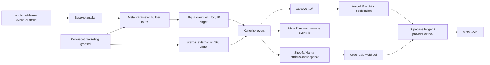

# Kanonisk Meta-attribusjon: produksjonsaudit og remediering

Statusdato: 2026-07-18. Status: produksjonsdeployert og verifisert. Dataset
Quality-trenden for events med lavt etterreleasevolum skal fortsatt følges over
7 og 14 dager.

## Konklusjon

Før denne remedieringen samlet alle kanoniske browserruter inn betrodd
Vercel-IP, user-agent og geolokasjon, men Meta-mapperne brukte ikke
geolokasjonen. `_fbp` og `_fbc` ble bare lest dersom andre tags allerede
hadde opprettet dem. Manglende `_fbc` ble feilaktig bygget fra event-tiden,
`external_id` kunne utebli når samtykke kom etter første render, PageView
hadde ingen Meta-worker, og Shopify purchase-webhooken arvet bare samtykke.

Den aktive produksjonsløsningen gjør nå følgende etter marketing-samtykke:

1. `fbclid` registreres fra hvilken som helst landingsrute og beholdes i
   besøkskonteksten gjennom intern navigasjon.
2. `POST /api/meta/parameter-context` bruker Metas offisielle
   `capi-param-builder-nodejs` med `PlainDataObject` til å opprette eller
   oppdatere `_fbp` og `_fbc` som 90-dagers førstepartscookies.
3. Den samme anonyme `utekos_external_id` opprettes eller gjenbrukes ved
   faktisk dispatch, også når samtykket ble gitt etter første render.
4. Alle kanoniske Meta-mappere bruker én felles user-data-mapper for
   `external_id`, `fbp`, `fbc`, IP, user-agent og samtykket Vercel-geodata.
5. `page_view` oppretter en Meta CAPI `PageView`-outboxrad med samme
   `event_id`. En tidsbasert claimant-cutover hindrer automatisk replay av
   historiske, blokkerte PageView-rader.
6. Web-GTM sender de samtykkede kanoniske browser-eventene med nøyaktig samme
   `event_id` som CAPI. Automatisk Meta-eventoppsett er deaktivert, slik at
   Smart Setup eller inferred events ikke lager en parallell eventtaksonomi.
7. Standard Shopify checkout venter på et validert attribusjonssnapshot i
   cart attributes før redirect, men har en fail-open-frist slik at tracking
   aldri kan låse betalingen. Purchase-webhooken gjenoppretter `external_id`,
   `_fbp`, `_fbc`, klikk-ID-er, GA-klient/session og samtykke.
8. Klarna Express sender den samme snapshotkontrakten til serveren og lagrer
   attribusjonen på Shopify-draftordren. Klarna-godkjenningstokenet brukes bare
   mot Klarna og lagres ikke som ordreattributt.

Releasen brukte eksisterende Supabase-skjema og outbox. Runtime Cache og Vercel
Queues ble ikke innført. Vercel-runtime er deployert fra `main`, Google Data
Manager-radgjelden er behandlet etter eksplisitt godkjenning, og server-GTM
versjon `29` er publisert uten legacy Measurement Protocol-taggen.
Web-GTM versjon `121` er publisert med kanonisk Meta Pixel-paritet.

## Verifiserte kilder

- [Meta external_id](https://developers.facebook.com/documentation/ads-commerce/conversions-api/parameters/external-id)
- [Meta server event parameters](https://developers.facebook.com/documentation/ads-commerce/conversions-api/parameters/server-event)
- [Meta fbp and fbc](https://developers.facebook.com/documentation/ads-commerce/conversions-api/parameters/fbp-and-fbc)
- [Meta Parameter Builder](https://developers.facebook.com/documentation/ads-commerce/conversions-api/parameter-builder-library)
- [Meta Parameter Builder workflow](https://developers.facebook.com/documentation/ads-commerce/conversions-api/parameter-builder-library/workflow-and-examples)
- [Meta end-to-end implementation](https://developers.facebook.com/documentation/ads-commerce/conversions-api/guides/end-to-end-implementation)
- [Meta Dataset Quality API](https://developers.facebook.com/documentation/ads-commerce/conversions-api/dataset-quality-api)
- [Meta Pixel Advanced Matching](https://developers.facebook.com/documentation/meta-pixel/advanced/advanced-matching)
- [facebook/capi-param-builder](https://github.com/facebook/capi-param-builder)
- [Google Tag Manager data layer](https://developers.google.com/tag-platform/tag-manager/datalayer)
- [Next.js Route Handlers](https://nextjs.org/docs/app/getting-started/route-handlers)
- [Next.js after](https://nextjs.org/docs/app/api-reference/functions/after)
- [Vercel geolocation and ipAddress](https://vercel.com/docs/functions/functions-api-reference/vercel-functions-package)
- [Shopify cartAttributesUpdate](https://shopify.dev/docs/api/storefront/latest/mutations/cartAttributesUpdate)

De lokale, offisielle Google-snapshotene i `docs/data-manager/*`,
`docs/data-manager/examples/*` og `docs/google.ads.datamanager.v1/*` ble brukt
for ingest-, request-ID-, statusrekonsiliering- og Measurement
Protocol-migreringskontrakten. Kontrollen omfattet også destinasjons-/header-
scenariene, fast-fail-feilmodellen, normalisering og hashing av `UserData`,
Googles grense på 2 000 events per `IngestEvents`-kall og de genererte
Node-eksemplene for både `ingestEvents` og `retrieveRequestStatus`.

Den installerte Parameter Builder-versjonen er `1.3.1`. Den legger et
versjonert appendix på nye og oppdaterte Meta-parametere. `fbclid` beholdes
case-sensitivt, og `_fbc` får tidspunktet da klikk-ID-en først kunne lagres;
event-tiden brukes ikke som erstatning.

## Aktiv identitetsflyt

Browseren får aldri velge `client_ip_address`, user-agent eller serverens
geolokasjon. Event-rutene erstatter klientverdier med `ipAddress(request)`,
request-headeren og `geolocation(request)`. Meta mottar by, postnummer og
land som normaliserte/haskede matchnøkler. Numeriske norske regionkoder sendes
ikke som Meta `st`, fordi Metas normalisering krever en alfabetisk state-verdi.
For `purchase` kommer webhook-requesten fra Shopify, ikke kundens browser.
Denne flyten bruker derfor Shopify sin verifiserte browser-IP/user-agent og
samtykkede leveringslokasjon, og bruker ikke Vercel-geolokasjonen til Shopify-
serveren som om den tilhørte kunden.

## Forskjell etter landingsside

| Scenario | Kanoniske events | Meta-identitet etter samtykke | Videreføring til purchase |
| --- | --- | --- | --- |
| Forside, innholdsside eller kategoriside | `page_view` | `_fbp`, eventuell `_fbc` fra `fbclid`, anonym `external_id`, IP/UA/geodata | Beholdes gjennom besøket; snapshot ved checkout |
| `/produkter/[handle]` | `page_view` + `view_item` | Samme identitet og samme `page_view_id`-reise | Ja |
| `/skreddersy-varmen` | `page_view` + kampanjens `view_item` | Samme globale identitetsflyt; ingen særbehandling av kampanje-URL | Ja |
| Intern Next.js-navigasjon etter Meta-annonselanding | Ny `page_view`, eventuelt nye commerce-events | Besøkslagret `fbclid` kan fortsatt opprette/gjenopprette `_fbc` | Ja |
| Tilbakevendende besøk uten ny `fbclid` | `page_view` og sideavhengige events | Eksisterende `_fbp`, `_fbc` og `external_id` gjenbrukes | Ja |
| Ny Meta-klikk-ID i samme browser | Vanlige events | Parameter Builder oppdaterer `_fbc` til nyeste klikk-ID | Ja |
| Samtykke gis etter første render | Ventende event flushes | Identifikatorer opprettes ved dispatch, ikke bare ved initial render | Ja |
| Marketing avslått | Bare tillatt analytics/operativ flyt | Landingssidens `fbclid` kan ligge midlertidig i fanens besøkskontekst, men ingen `_fbc`, `_fbp`, `external_id`, kanonisk Meta-dispatch eller Meta-outbox opprettes | Bare samtykkestatus; ingen attribusjon eksporteres |
| Standard Shopify checkout | `begin_checkout`, senere webhook-`purchase` | Snapshot skrives før redirect | Cart attributes → order note attributes |
| Klarna Express | Direkte betalings-/ordreflyt | Snapshot tas før `/api/klarna/orders` | Draft-order custom attributes |

Landingsruten påvirker derfor hvilke semantiske events som finnes, men ikke om
den globale Meta-identiteten kan fanges. Alle sider eies av den samme root-
monterte PageView-observeren.

Runtime-auditen avdekket og rettet én reell forskjell ved direkte landing på
`/produkter/[handle]`: produktets normalisering av standardvalg kunne endre
query-parametrene før `view_item` bandt seg til PageView. Koblingen følger nå
samme origin og pathname, men bruker den faktiske PageView-URL-en og nekter å
følge navigasjon til en annen ressurs. Direkte produktlanding sender dermed
`page_view` og `view_item` med samme `page_view_id` også når query-parametrene
normaliseres.

## Eventdekning til Meta

Produksjonsaktive serveradaptere etter remedieringen:

- `page_view` → `PageView`
- `view_item` → `ViewContent`
- `add_to_wishlist` → `AddToWishlist`
- `add_to_cart` → `AddToCart`
- `begin_checkout` → `InitiateCheckout`
- `purchase` → `Purchase`
- `search` → `Search`
- `generate_lead` → `Lead`

Web-GTM versjon `121` har i tillegg Meta Pixel-tag `153` og kanonisk trigger
`152`. Pixel-pariteten omfatter `PageView`, `ViewContent`, `AddToCart`,
`InitiateCheckout`, `Search` og `Lead`. Browser-`Purchase` er bevisst ikke
aktivert; betalt ordre eies fortsatt av den idempotente Shopify-webhooken.

Pixel-taggen venter på `fbp`, eventuell `fbc` og stabil `external_id`, bruker
kanonisk `event_id` som Metas `eventID`, og sender bare eventet som tilhører
gjeldende pathname. `fbq('set', 'autoConfig', false, PIXEL_ID)` kjøres før
`init`, og produksjonssmoken viste `AutomaticSetup=false` og ingen uventede
Meta-events. Dette opprettholder kanonisk event tracking og gir Meta samme ID
for browser/server-deduplisering.

Parameter Builder oppretter `_fbp`/`_fbc` med prosjektets dokumenterte
førstepartskontrakt. Etter at Metas offisielle SDK initialiseres, ble de aktive
Meta-cookieverdiene observert med domene/path og `SameSite=Lax`, men
`Secure=false`; `utekos_external_id` beholdt `Secure`. Auditverktøyet krever
derfor korrekt verdi, levetid og scope for Meta-cookieverdiene uten å påstå at
SDK-en beholder `Secure`-attributtet.

## Dataset Quality før og etter release

Read-only Dataset Quality viste før denne lokale endringen:

| Meta-event | EMQ | Relevant identifikatordekning |
| --- | ---: | --- |
| `AddToCart` | 3.0 | IP 100 %, UA 100 %; manglende browser-ID-er |
| `InitiateCheckout` | 5.1 | IP/UA 100 %, `fbp` 25 %, `fbc` 25 % |
| `ViewContent` | 4.9 | IP 98,8 %, UA 100 %, `fbp` 7,6 %, `fbc` 73,3 % |
| `Purchase` | 9.3 | `fbp`/`fbc` 75 %; øvrige sterke kundematchnøkler 100 % |

Historisk Shopify-rapport for 804 ordre viste `fbp` 45,1 %, `fbc` 26,5 % og
minst én betalt klikk-ID 1,0 %. De ni historiske checkout-snapshotene hadde
`fbp` 100 %, `fbc` 44,4 % og `external_id` 100 %.

Siste read-only Dataset Quality-øyeblikksbilde etter produksjonsrelease:

| Meta-event | EMQ | Identifikatordekning | Events siste 24 timer |
| --- | ---: | --- | ---: |
| `PageView` | 6.6 | IP/UA/land 100 %, `fbp` 95,4 %, `external_id` 98,2 %, `fbc` 68,8 %, postnummer/by 76,2 % | 156 |
| `AddToCart` | 6.3 | IP/UA 100 %, `fbp`/`external_id`/postnummer/land/by 75 %, `fbc` 66,7 % | 15 |
| `InitiateCheckout` | 5.9 | IP/UA 100 %, `fbp` 57,1 %, `external_id`/postnummer/land/by/`fbc` 42,9 % | 7 |
| `ViewContent` | 5.5 | IP 99,4 %, UA 100 %, `fbp` 35,1 %, `external_id` 40,7 %, `fbc` 77,3 % | 309 |
| `Purchase` | 9.3 | e-post/IP/UA/telefon/`fbp`/`external_id`/adresse/navn 100 %, `fbc` 50 % | 8 |

Sammenlignet med forrige read-only kontroll er `PageView` uendret på 6.6,
`ViewContent` økt fra 5.1 til 5.5, `AddToCart` fra 3.6 til 6.3 og
`InitiateCheckout` fra 5.5 til 5.9. `Purchase` er uendret på 9.3. Dataset
Quality er en rullerende providerflate; dette kan ikke tilskrives de fem nye
smoke-eventene alene.

Metas oppdaterte 24-timers kildeuttrekk viser nå to browser-`PageView` og to
browser-`ViewContent` i 12:00 PT-bøtten. Det tidligere kildeetterslepet er
dermed løst i providerflaten og samsvarer med 200-svarene fra både Pixel
`/tr` og Metas OpenBridge. Servervolumet dominerer fortsatt, og kilde- og
Dataset Quality-tallene skal leses som rullerende providerøyeblikksbilder.

En ny avgrenset kvalitetssamler gjør oppfølgingen reproducerbar uten å gi
Meta-skriverett. `/api/cron/meta-dataset-quality` leser `v25.0` daglig kl.
03:17 UTC, sender tokenet i `Authorization`-headeren, validerer hele den
eksterne responsen med Zod og lagrer eventnivåets EMQ, match-key coverage,
diagnostikk, event coverage, dedupliseringsfeedback, freshness og ACR i
`marketing.meta_quality_snapshots`. Innsettingen er én transaksjon og
idempotent per dataset/event/UTC-dag; ingen migrasjon eller provider-mutasjon
er nødvendig.

Den nye koden ble kjørt med produksjonslegitimasjon. Den hentet seks
eventtyper og skrev seks snapshots med felles måletid
`2026-07-18T21:21:27.253Z`; readback viste korrekt EMQ og 7–13 match keys per
event. Umiddelbar ny kjøring ga `insertedCount=0`. Meta returnerte foreløpig
ikke event coverage eller dedupliseringsfeedback for dette datasettet, og
samleren lagrer derfor disse feltene som ikke returnert fremfor å tolke dem
som 0.

Runtime-releasen `dpl_EtXm5e58YNqzx4E2xVFvXwr14u76` for kode-SHA
`da2e3191a947589a084d15b6d794211bbb3dd1a3` nådde `READY` og er artefaktet
som cron-/ruteverifikasjonen ble utført mot. Senere rene
dokumentasjonsdeployments kan flytte produksjonsaliasene uten å endre
runtime-artefaktet; aktuell aliaseier må derfor kontrolleres med
`vercel inspect`. Vercel viser
cron-definisjonen som aktiv uten ventende eller endrede definisjoner.
Produksjonsruten returnerte 401 uten legitimasjon og 200 med godkjent
bearer-token, begge med `Cache-Control: no-store`; den autoriserte
samme-dagskjøringen fant seks eventtyper og satte inn null duplikater.

Read-only kildefordeling for perioden etter cutover,
`2026-07-18T20:20Z–21:12Z`, var:

| Meta-event | Server | Browser |
| --- | ---: | ---: |
| `PageView` | 75 | 51 |
| `ViewContent` | 75 | 38 |
| `AddToCart` | 2 | 1 |
| `InitiateCheckout` | 2 | 1 |
| `Purchase` | 2 | 1 |

Dette er en startmåling, ikke en 7-/14-dagers trend. Særlig de tre
lower-funnel-radene har for lav denominator til konklusjon.

## Data Manager og Measurement Protocol

Aktiv kildekode inneholder ingen direkte GA4 Measurement Protocol-transport;
kanoniske Google-serverevents bruker Google Data Manager API. Legacy-taggen
`GA4 - MP Purchase` ble fjernet fra server-GTM og versjon `29` ble publisert.
Live servercontainer er derfor Data Manager-/sGTM-basert uten denne parallelle
Measurement Protocol-transporten.

Produksjonssettet bestod av 628 Google Data Manager-dead letters: 594
overlange additional event-verdier, 29 events uten gyldig GA client ID og 5
events utenfor provider-vinduet. De 594 kvalifiserte radene ble requeue-et
etter mapperfixen. 593 ble akseptert av Data Manager; én historisk
`begin_checkout` manglet dagens obligatoriske `cart_id` og ble lukket som
`historical_payload_incompatible`. De 29 uten client ID og de 5 utenfor vinduet
ble lukket fail-closed uten providerkall. To nye browser-clock-skew-rader ble
deretter requeue-et etter timestamp-clamp og akseptert. Totalt ble 595
aksepterte dead-letter-auditrader løst. Google har 0 failed/dead-lettered og
0 uløste dead letters.

`IngestEvents`-svarene er i tillegg rekonsilert asynkront med den offisielle
`request_id`-kontrakten. Kontrollerte statusbatcher flyttet utførte requests
til `provider_confirmed_success` uten dead letters eller ukjent status. Ved
kontroll 2026-07-18T21:32Z var 340 requests providerbekreftet `SUCCESS`, mens
116 utførte requests fortsatt var ikke-terminale; 60 av dem var sist
bekreftet `PROCESSING`. De 987 historiske `validate_only=true`-radene er
valideringskall og er med hensikt ikke statuskandidater. Ingen
`PROCESSING`-rad rapporteres som levert.

## Hvorfor ikke Vercel Queue eller Runtime Cache

- Runtime Cache er delt applikasjonscache og er ikke egnet som lager for
  kundeidentifikatorer eller attribusjon.
- Vercel Queues er fortsatt offentlig beta og har begrenset retention. Å legge
  en ny kø ved siden av den atomiske Supabase ledger/outboxen ville svekket
  revisjonsspor og idempotens.
- Next.js `after()` brukes bare til å starte en umiddelbar, tidsavgrenset
  outbox-claim. Supabase-raden er den varige retry-kilden dersom funksjonen
  avsluttes.

## Verifikasjon

- Tidligere full analyticsuite med 218/218 tester og snapshot-samlerens nye
  målrettede 7/7 tester: grønt. Målrettet ESLint og `tsc --noEmit`: grønt.
- Next.js route typegen, MCP build med 52 servere og MCP doctor: grønt.
- Produksjonsbuild: grønt med 120 sider/ruter.
- Kontrollert Playwright-smoke med provider-rutene blokkert viste at
  landingssidens `fbclid` ble beholdt i fanens besøkskontekst, men ingen
  `_fbc`, `_fbp`, `external_id` eller kanonisk Meta-dispatch ble opprettet før
  samtykke. Etter marketing-samtykke fikk forside, direkte produktside og
  kampanjeside korrekt `fbclid`, `_fbc`, `_fbp` og stabil `external_id`;
  intern navigasjon beholdt identiteten.
- Direkte produktlanding ga én `view_item` bundet til samme `page_view_id` som
  PageView etter query-normalisering.
- Live gateway-smoke mot `https://utekos.no` er grønn:
  `/__sgtm/healthy` returnerte `Cache-Control: no-store, max-age=0` og
  `x-vercel-cache: MISS`. Standardkommandoen mot lokal Next-dev feiler fordi
  den eksterne rewrite-responsen ikke arver Vercel-headerregelen; dette er ikke
  en feil på live gateway, men forblir et lokalt smoke-avvik.
- Produksjonssmoke bekreftet ingen Meta-cookies før marketing-samtykke. Etter
  samtykke ble én `_fbp`, én `_fbc` med test-`fbclid` og stabil
  `utekos_external_id` opprettet med 90-dagers Meta-cookielevetid.
- Den reproducerbare produksjonsgaten `npm run tracking:meta-pixel:smoke`
  passerte på forside, `/produkter/utekos-dun` og `/skreddersy-varmen`. Hver
  flate beviste null Meta før samtykke, korrekt cookie-/hashparitet, samme
  kanoniske `event_id`, 200-svar fra både Pixel `/tr` og OpenBridge, ingen
  Meta-CSP-brudd, `AutomaticSetup=false` og ingen uventede Meta-events.
  Meta SDK-ens kontroll/fallback kan logge en avbrutt OpenBridge-duplikat etter
  at samme kall allerede har svart 200; gaten krever det observerte 200-svaret
  og Pixel `/tr` 200, og klassifiserer ikke dette som providerfeil.
- De fem PageView/ViewContent-ID-ene fra den siste browser-smoken finnes
  nøyaktig én gang i `marketing.event_ledger` og én gang i Meta-outboxen. Alle
  fem CAPI-radene hadde `attempt_count=1`, ingen feil, `eventsReceived=1`, tom
  `messages` og `fbTraceId`; payloadens `external_id`, `fbp`, `fbc`, `fbclid`
  og `event_id` matchet ledgeren.
- Live PageView og ViewContent inneholdt betrodd IP/UA/geodata og ble akseptert
  av Meta med `events_received=1`. Claimant-cutoveren hindret historisk
  PageView-replay.
- Standard Shopify checkout beholdt `_fbp`, `_fbc`, `fbclid` og `external_id`
  byte-for-byte fra browser til cart attributes. Ekte, betalt ordre `1866`
  kom fra en samtykket Facebook-landing og gikk fra kanonisk
  `begin_checkout` til webhook-`purchase` på 36 sekunder. Shopify-ordrens
  custom attributes, checkout-eventet og Purchase-eventet hadde identiske
  `external_id`, `_fbp`, `_fbc` og `fbclid`. Shopify Payments rapporterte
  `SALE/SUCCESS` med `test=false`, og Meta mottok Purchase på første forsøk med
  `eventsReceived=1`, tom `messages` og trace-ID.
- Google Data Manager mottok samme Purchase med `validate_only=false` og en
  lagret `request_id`. Den var fortsatt `PROCESSING` ved kontroll
  2026-07-18T20:47:54Z, men statusforsøk 4 returnerte terminal `SUCCESS` kl.
  21:31:06Z. Raden er nå `succeeded/provider_confirmed_success`, uten feil og
  med den opprinnelige request-ID-en beholdt.
- Klarna production Client ID og serverlegitimasjon ble validert fail-closed.
  Live Express-knappen åpnet den ekte Klarna/BankID-flaten uten å miste
  merchant-URL-en. En full betaling ble ikke gjennomført fordi den ville ha
  opprettet en reell ordre; full betalingssmoke skal bruke Klarna Playground
  eller en godkjent reell handel. En read-only kontroll av post-releaseordrene
  fant ingen Klarna-betaling som kunne lukke denne gaten.
- Provider-rapporten etter opprydding viser 0 failed/dead-lettered og 0 uløste
  Google/Meta dead letters. Utførte Data Manager-requests med `PROCESSING`
  står separat som statuskandidater og er ikke dispatch-feil. Microsoft-varselet er
  bevisst: serveradapteren er ikke aktiv etter resetten, og historiske rader er
  lukket som `skipped_unqualified`, ikke fremstilt som levert.

## Gjenstående observasjon

1. Bruk de daglige Supabase-snapshotene og les Metas kildefordeling på nytt
   etter 7 og 14 dager for `AddToCart`, `InitiateCheckout` og `Purchase`;
   nåværende etterreleasevolum er for lavt til en sikker trendkonklusjon.
2. Kjør en full Klarna Playground-betaling eller observer neste godkjente
   livebetaling for å bevise hele Klarna → Shopify → purchase-webhook-kjeden.
3. Microsoft UET CAPI må fortsatt reintroduseres med en registrert
   serveradapter før Microsoft kan få serverlevering; 0 aktive kø-rader betyr
   ikke at denne adapteren finnes.
