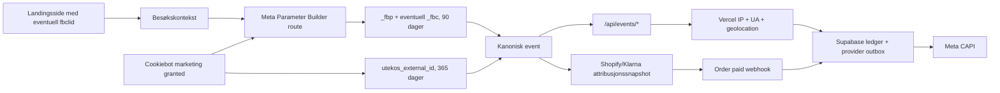

# Kanonisk Meta-attribusjon: audit og lokal remediering

Statusdato: 2026-07-18. Status: implementert og verifisert lokalt, ikke
produksjonsdeployert.

## Konklusjon

Før denne remedieringen samlet alle kanoniske browserruter inn betrodd
Vercel-IP, user-agent og geolokasjon, men Meta-mapperne brukte ikke
geolokasjonen. `_fbp` og `_fbc` ble bare lest dersom andre tags allerede
hadde opprettet dem. Manglende `_fbc` ble feilaktig bygget fra event-tiden,
`external_id` kunne utebli når samtykke kom etter første render, PageView
hadde ingen Meta-worker, og Shopify purchase-webhooken arvet bare samtykke.

Den lokale løsningen gjør nå følgende etter marketing-samtykke:

1. `fbclid` registreres fra hvilken som helst landingsrute og beholdes i
   besøkskonteksten gjennom intern navigasjon.
2. `POST /api/meta/parameter-context` bruker Metas offisielle
   `capi-param-builder-nodejs` med `PlainDataObject` til å opprette eller
   oppdatere `_fbp` og `_fbc` som 90-dagers førstepartscookies.
3. Den samme anonyme `utekos_external_id` opprettes eller gjenbrukes ved
   faktisk dispatch, også når samtykket ble gitt etter første render.
4. Alle kanoniske Meta-mappere bruker én felles user-data-mapper for
   `external_id`, `fbp`, `fbc`, IP, user-agent og samtykket Vercel-geodata.
5. `page_view` oppretter en Meta CAPI `PageView`-outboxrad med samme
   `event_id`. En tidsbasert claimant-cutover hindrer automatisk replay av
   historiske, blokkerte PageView-rader.
6. Standard Shopify checkout venter på et validert attribusjonssnapshot i
   cart attributes før redirect, men har en fail-open-frist slik at tracking
   aldri kan låse betalingen. Purchase-webhooken gjenoppretter `external_id`,
   `_fbp`, `_fbc`, klikk-ID-er, GA-klient/session og samtykke.
7. Klarna Express sender den samme snapshotkontrakten til serveren og lagrer
   den på Shopify-draftordren.

Ingen Supabase-skjemaendring, Runtime Cache, Vercel Queue, GTM-publisering,
provider-mutasjon eller produksjonsdeploy inngår i den lokale endringen.

## Verifiserte kilder

- [Meta external_id](https://developers.facebook.com/documentation/ads-commerce/conversions-api/parameters/external-id)
- [Meta server event parameters](https://developers.facebook.com/documentation/ads-commerce/conversions-api/parameters/server-event)
- [Meta fbp and fbc](https://developers.facebook.com/documentation/ads-commerce/conversions-api/parameters/fbp-and-fbc)
- [Meta Parameter Builder](https://developers.facebook.com/documentation/ads-commerce/conversions-api/parameter-builder-library)
- [Meta Parameter Builder workflow](https://developers.facebook.com/documentation/ads-commerce/conversions-api/parameter-builder-library/workflow-and-examples)
- [Meta end-to-end implementation](https://developers.facebook.com/documentation/ads-commerce/conversions-api/guides/end-to-end-implementation)
- [Meta Dataset Quality API](https://developers.facebook.com/documentation/ads-commerce/conversions-api/dataset-quality-api)
- [facebook/capi-param-builder](https://github.com/facebook/capi-param-builder)
- [Next.js Route Handlers](https://nextjs.org/docs/app/getting-started/route-handlers)
- [Next.js after](https://nextjs.org/docs/app/api-reference/functions/after)
- [Vercel geolocation and ipAddress](https://vercel.com/docs/functions/functions-api-reference/vercel-functions-package)
- [Shopify cartAttributesUpdate](https://shopify.dev/docs/api/storefront/latest/mutations/cartAttributesUpdate)

Den installerte Parameter Builder-versjonen er `1.3.1`. Den legger et
versjonert appendix på nye og oppdaterte Meta-parametere. `fbclid` beholdes
case-sensitivt, og `_fbc` får tidspunktet da klikk-ID-en først kunne lagres;
event-tiden brukes ikke som erstatning.

## Aktiv identitetsflyt

Browseren får aldri velge `client_ip_address`, user-agent eller serverens
geolokasjon. Event-rutene erstatter klientverdier med `ipAddress(request)`,
request-headeren og `geolocation(request)`. Meta mottar by, postnummer og
land som normaliserte/haskede matchnøkler. Numeriske norske regionkoder sendes
ikke som Meta `st`, fordi Metas normalisering krever en alfabetisk state-verdi.
For `purchase` kommer webhook-requesten fra Shopify, ikke kundens browser.
Denne flyten bruker derfor Shopify sin verifiserte browser-IP/user-agent og
samtykkede leveringslokasjon, og bruker ikke Vercel-geolokasjonen til Shopify-
serveren som om den tilhørte kunden.

## Forskjell etter landingsside

| Scenario | Kanoniske events | Meta-identitet etter samtykke | Videreføring til purchase |
| --- | --- | --- | --- |
| Forside, innholdsside eller kategoriside | `page_view` | `_fbp`, eventuell `_fbc` fra `fbclid`, anonym `external_id`, IP/UA/geodata | Beholdes gjennom besøket; snapshot ved checkout |
| `/produkter/[handle]` | `page_view` + `view_item` | Samme identitet og samme `page_view_id`-reise | Ja |
| `/skreddersy-varmen` | `page_view` + kampanjens `view_item` | Samme globale identitetsflyt; ingen særbehandling av kampanje-URL | Ja |
| Intern Next.js-navigasjon etter Meta-annonselanding | Ny `page_view`, eventuelt nye commerce-events | Besøkslagret `fbclid` kan fortsatt opprette/gjenopprette `_fbc` | Ja |
| Tilbakevendende besøk uten ny `fbclid` | `page_view` og sideavhengige events | Eksisterende `_fbp`, `_fbc` og `external_id` gjenbrukes | Ja |
| Ny Meta-klikk-ID i samme browser | Vanlige events | Parameter Builder oppdaterer `_fbc` til nyeste klikk-ID | Ja |
| Samtykke gis etter første render | Ventende event flushes | Identifikatorer opprettes ved dispatch, ikke bare ved initial render | Ja |
| Marketing avslått | Bare tillatt analytics/operativ flyt | Landingssidens `fbclid` kan ligge midlertidig i fanens besøkskontekst, men ingen `_fbc`, `_fbp`, `external_id`, kanonisk Meta-dispatch eller Meta-outbox opprettes | Bare samtykkestatus; ingen attribusjon eksporteres |
| Standard Shopify checkout | `begin_checkout`, senere webhook-`purchase` | Snapshot skrives før redirect | Cart attributes → order note attributes |
| Klarna Express | Direkte betalings-/ordreflyt | Snapshot tas før `/api/klarna/orders` | Draft-order custom attributes |

Landingsruten påvirker derfor hvilke semantiske events som finnes, men ikke om
den globale Meta-identiteten kan fanges. Alle sider eies av den samme root-
monterte PageView-observeren.

Runtime-auditen avdekket og rettet én reell forskjell ved direkte landing på
`/produkter/[handle]`: produktets normalisering av standardvalg kunne endre
query-parametrene før `view_item` bandt seg til PageView. Koblingen følger nå
samme origin og pathname, men bruker den faktiske PageView-URL-en og nekter å
følge navigasjon til en annen ressurs. Direkte produktlanding sender dermed
`page_view` og `view_item` med samme `page_view_id` også når query-parametrene
normaliseres.

## Eventdekning til Meta

Lokalt aktive serveradaptere etter remedieringen:

- `page_view` → `PageView`
- `view_item` → `ViewContent`
- `add_to_wishlist` → `AddToWishlist`
- `add_to_cart` → `AddToCart`
- `begin_checkout` → `InitiateCheckout`
- `purchase` → `Purchase`
- `search` → `Search`
- `generate_lead` → `Lead`

Meta bruker `event_id` fra den kanoniske eventen. Den publiserte web-GTM-
containeren har per auditdato ingen Meta Pixel-tag. Dermed finnes ingen aktiv
browser/server-dedupekonflikt for disse eventene. Dersom Pixel gjeninnføres,
må browser-eventet bruke nøyaktig samme `event_id`; dette er en egen GTM-
publisering med eksplisitt godkjenning.

## Live baseline før release

Read-only Dataset Quality viste før denne lokale endringen:

| Meta-event | EMQ | Relevant identifikatordekning |
| --- | ---: | --- |
| `AddToCart` | 3.0 | IP 100 %, UA 100 %; manglende browser-ID-er |
| `InitiateCheckout` | 5.1 | IP/UA 100 %, `fbp` 25 %, `fbc` 25 % |
| `ViewContent` | 4.9 | IP 98,8 %, UA 100 %, `fbp` 7,6 %, `fbc` 73,3 % |
| `Purchase` | 9.3 | `fbp`/`fbc` 75 %; øvrige sterke kundematchnøkler 100 % |

Historisk Shopify-rapport for 804 ordre viste `fbp` 45,1 %, `fbc` 26,5 % og
minst én betalt klikk-ID 1,0 %. De ni historiske checkout-snapshotene hadde
`fbp` 100 %, `fbc` 44,4 % og `external_id` 100 %. Tallene er baseline, ikke
bevis for effekten av den ureleasede koden.

## Data Manager og Measurement Protocol

Aktiv kildekode inneholder ingen direkte GA4 Measurement Protocol-transport;
kanoniske Google-serverevents bruker Google Data Manager API. Read-only audit
av publisert server-GTM fant likevel en eldre tag med navnet
`GA4 - MP Purchase`. Full erstatning er derfor ikke produksjonsbekreftet før
den taggen er fjernet eller dokumentert deaktivert og containeren publisert.
Det krever separat, eksplisitt GTM-godkjenning.

Provider-rapporten ved `2026-07-18T14:34:57Z` viste 625 uavklarte Google Data
Manager-dead letters. Klassifiseringen var 594 avviste parameterverdier over
100 tegn, 29 events uten gyldig GA client ID og 2 events utenfor tidsvinduet.
Mapperen er derfor korrigert til 100 tegn for alle additional event-verdier,
og fremtidige hendelser uten client ID blir registrert som
`skipped_unqualified/missing_client_id`. Bare de 594 eksakt samsvarende og
fortsatt tidsmessig kvalifiserte radene kan requeue-es etter deploy; de øvrige
skal lukkes fail-closed uten provider-replay.

## Hvorfor ikke Vercel Queue eller Runtime Cache

- Runtime Cache er delt applikasjonscache og er ikke egnet som lager for
  kundeidentifikatorer eller attribusjon.
- Vercel Queues er fortsatt offentlig beta og har begrenset retention. Å legge
  en ny kø ved siden av den atomiske Supabase ledger/outboxen ville svekket
  revisjonsspor og idempotens.
- Next.js `after()` brukes bare til å starte en umiddelbar, tidsavgrenset
  outbox-claim. Supabase-raden er den varige retry-kilden dersom funksjonen
  avsluttes.

## Lokal verifikasjon

- 218/218 analysetester, målrettet ESLint og `tsc --noEmit`: grønt.
- Next.js route typegen, MCP build med 52 servere og MCP doctor: grønt.
- Produksjonsbuild: grønt med 118/118 statiske/PPR-sider.
- Kontrollert Playwright-smoke med provider-rutene blokkert viste at
  landingssidens `fbclid` ble beholdt i fanens besøkskontekst, men ingen
  `_fbc`, `_fbp`, `external_id` eller kanonisk Meta-dispatch ble opprettet før
  samtykke. Etter marketing-samtykke fikk forside, direkte produktside og
  kampanjeside korrekt `fbclid`, `_fbc`, `_fbp` og stabil `external_id`;
  intern navigasjon beholdt identiteten.
- Direkte produktlanding ga én `view_item` bundet til samme `page_view_id` som
  PageView etter query-normalisering.
- Live gateway-smoke mot `https://utekos.no` er grønn:
  `/__sgtm/healthy` returnerte `Cache-Control: no-store, max-age=0` og
  `x-vercel-cache: MISS`. Standardkommandoen mot lokal Next-dev feiler fordi
  den eksterne rewrite-responsen ikke arver Vercel-headerregelen; dette er ikke
  en feil på live gateway, men forblir et lokalt smoke-avvik.

## Produksjonsgater

Før status kan endres fra «lokalt implementert» til «produksjonsverifisert»:

1. Eksplisitt godkjenn og deploy Vercel-runtimeendringen.
2. Bekreft ingen Meta-cookies før marketing-samtykke.
3. Land på forside, produktside og kampanjeside med test-`fbclid`; aksepter
   marketing og bekreft én `_fbp`, én `_fbc`, korrekt appendix, 90-dagers
   levetid og stabil `external_id`.
4. Bekreft kanonisk PageView/ViewContent med Vercel IP/UA/geodata i ledger og
   nye Meta-outboxrader etter claimant-cutover.
5. Bekreft Meta `events_received=1` og ingen historisk PageView-replay.
6. Kjør standard checkout og Klarna Express; bekreft attrs og at purchase
   gjenbruker samme `external_id`, `fbp`, `fbc` og klikk-ID-er.
7. Les Dataset Quality på nytt etter tilstrekkelig trafikk. Sammenlign mot
   baseline per event; ikke bruk en enkelt smoke-event som trendbevis.
8. Behandle eventuell fjerning av `GA4 - MP Purchase` som separat GTM-publish.
