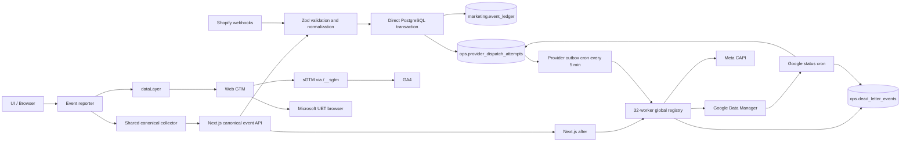
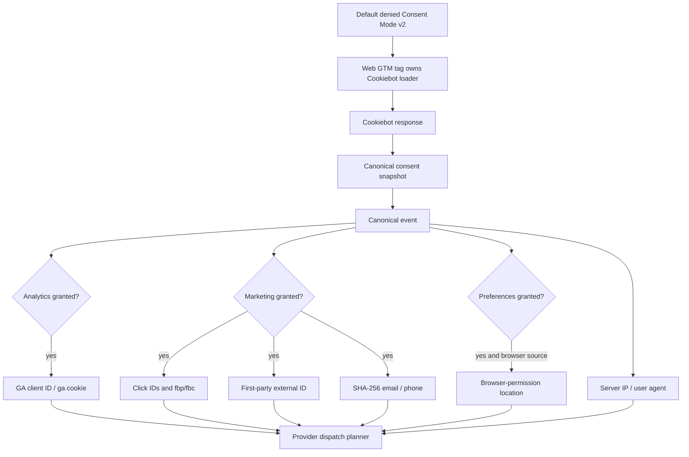
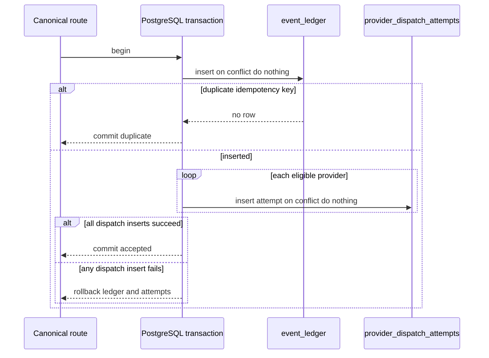
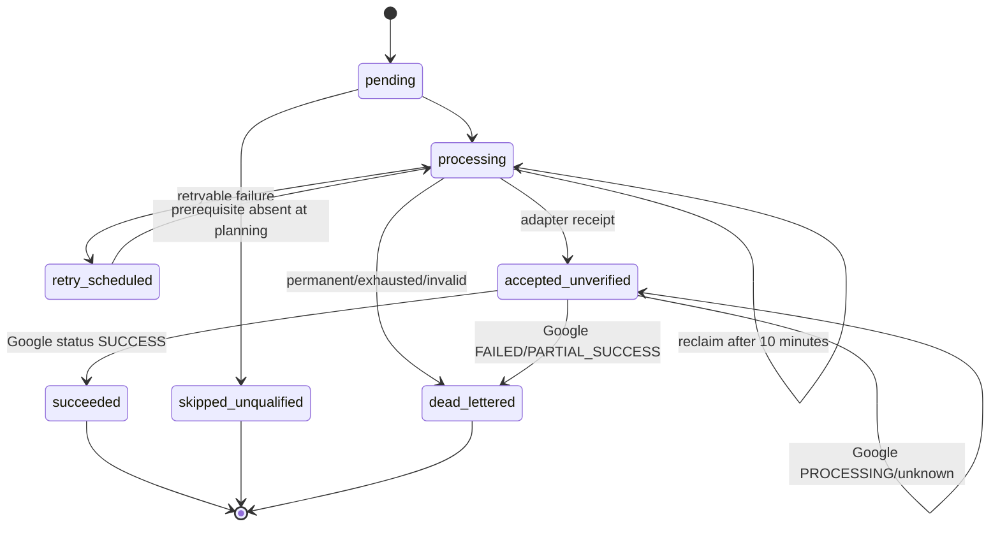

# Canonical analytics data flow

## Current implemented flow

The `After -> Registry` edge is the confirmed P0: every successful request invokes every registered worker, not only attempts created by that request.

## Consent and identity flow

## Atomic acceptance

## Provider status lifecycle

Meta currently stops at `accepted_unverified` unless a later administrative/data repair changes the row.
