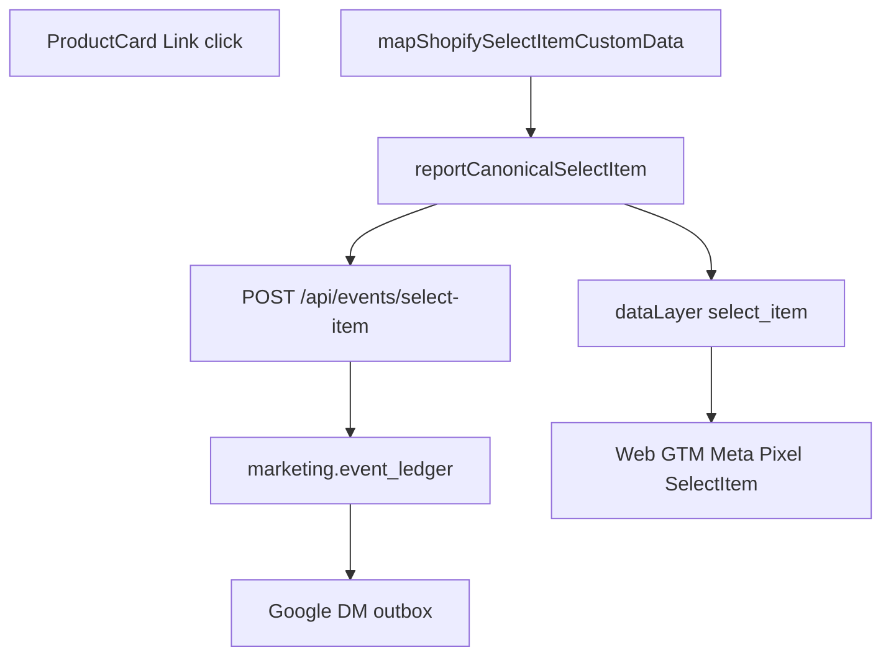

# select_item UI wiring — Implementation Plan

> **For agentic workers:** REQUIRED SUB-SKILL: Use superpowers:subagent-driven-development (recommended) or superpowers:executing-plans to implement this plan task-by-task. Steps use checkbox (`- [ ]`) syntax for tracking.

**Goal:** Fire canonical `select_item` exactly once when a shopper accepts a product selection from a resolved list (primary: product card navigation), using the proven ATC path: reporter → `dataLayer` + `/api/events/select-item` → ledger → Google DM outbox, with GTM Meta browser mapping `select_item` → `SelectItem` and shared `event_id`.

**Architecture:** Keep [`reportCanonicalSelectItem`](src/lib/analytics/selectItemReporter.ts) as the only browser emitter. Add a small pure mapper from Shopify product/variant + list context → `CanonicalSelectItemCustomData`. Wire product-card (and any other accepted list links in scope) to call the reporter on accepted click **before** navigation. Extend the committed Meta Pixel template map; publish web GTM only with explicit approval. Do **not** invent Meta CAPI for `select_item` in this microtask unless catalog is explicitly extended — today [`eventCatalog.ts`](src/lib/analytics/eventCatalog.ts) marks Meta `notRelevant` for `select_item` (Google + first-party + PostHog catalog flags only). Microsoft server is out of scope for this event (matrix: `-`); browser UET only if an existing GTM pattern already listens to `select_item`.

**Tech Stack:** Next.js client components, existing Zod event + collector transport, Node `node:test` + `tsx`, web GTM Meta template under `config/gtm/`.

**Design source:** [docs/superpowers/specs/2026-07-24-canonical-stale-events-design.md](docs/superpowers/specs/2026-07-24-canonical-stale-events-design.md) (event queue #1).

## Global Constraints

- One semantic selection → one `event_id` → one ledger row.
- Fail-closed Zod; reporter must not block navigation (fire-and-forget; errors via `queueMicrotask` throw as today).
- No `useMemo` / `useCallback`.
- No PascalCase as app contract; GTM maps to `SelectItem`.
- Do not start queue events #2–11 in this microtask.
- No production deploy / GTM publish without explicit user approval ([DEPLOYMENT.md](DEPLOYMENT.md)).
- Stop after microtask commit; no push unless authorized.

## Governance preflight (state before writes)

```text
Charter-version: CanonicalEvent (handoff 1.19.0; charter file path may live under docs/analytics — verify before write)
Roadmap task: SAFE — select_item UI detector wiring (stale-events queue #1; not a CE-* roadmap id)
Affected invariants: one occurrence one event_id; consent fail-closed; provider payloads derive from canonical
Goal: wire select_item from product-list selection; verify dataLayer + API + ledger + Google DM; Meta browser via GTM map
Non-goals: add_to_wishlist, checkout extensions, hero/accordion/quickview, Meta CAPI for select_item unless catalog change approved in-task
Allowed files/systems: listed below + evidence note + optional GTM template (publish gated)
Start SHA: d7ade6b37295230e971fe2bb3969361deeb59c54
Documentation status: design spec + event-matrix + selectItemReporter sufficient
```

## File map

| File | Role |
|------|------|
| Create [`src/lib/analytics/mapShopifySelectItemCustomData.ts`](src/lib/analytics/mapShopifySelectItemCustomData.ts) | Pure mapper → `CanonicalSelectItemCustomData` |
| Create [`src/lib/analytics/mapShopifySelectItemCustomData.test.ts`](src/lib/analytics/mapShopifySelectItemCustomData.test.ts) | Unit tests |
| Modify [`src/components/ProductCard/ProductCard.tsx`](src/components/ProductCard/ProductCard.tsx) | On accepted product-link click → `reportCanonicalSelectItem` |
| Optional: other list surfaces that navigate to PDP with product context (only if same pattern; do not broaden to promotion clicks) | Same reporter |
| Modify [`config/gtm/web-meta-pixel.html`](config/gtm/web-meta-pixel.html) | Add `select_item: 'SelectItem'` to `EVENT_NAMES` |
| Modify [`src/lib/analytics/selectItemReporter.ts`](src/lib/analytics/selectItemReporter.ts) | Remove “no detector” comment when wired |
| Create [`docs/analytics/evidence/ce-select-item-ui-wiring.md`](docs/analytics/evidence/ce-select-item-ui-wiring.md) | Verification evidence |
| Update [`docs/analytics/event-matrix.md`](docs/analytics/event-matrix.md) / known-deviations if a DEV id tracks unwired `select_item` | Status only |



## Current baseline (do not re-build)

- Event Zod + reporter + collector: `selectItemEvent.ts`, `selectItemReporter.ts`, `selectItemCollectorTransport.ts`
- Route: `src/app/api/events/select-item/route.ts`
- Google worker: `google:select_item` in `providerOutboxWorkerRegistry.ts`
- UI gap: `ProductCard` only has `data-track='ProductCardViewMoreClick'` — **no** `reportCanonicalSelectItem` call
- Meta template (`web-meta-pixel.html`) has **no** `select_item` entry today

---

### Task 1: Pure mapper + failing tests

**Files:**

- Create: `src/lib/analytics/mapShopifySelectItemCustomData.ts`
- Test: `src/lib/analytics/mapShopifySelectItemCustomData.test.ts`

**Input:**

- `product: ShopifyProduct`
- `variant: ShopifyProductVariant` (selected or first available)
- `itemListId: string` (stable list id, e.g. `frontpage_product_grid`, `produkter_oversikt`, collection handle)
- `destinationUrl: string` (absolute or site-absolute product URL that satisfies Zod `.url()` — use absolute `https://utekos.no/...` or `window.location.origin` + path at call site)
- `interactionId: string` (caller supplies `crypto.randomUUID()`)

**Output:** `CanonicalSelectItemCustomData` with `items` length 1. Reuse pricing/item field construction from [`shopifyViewItemCommerce.ts`](src/lib/analytics/shopifyViewItemCommerce.ts) (extract shared helper only if zero-risk; else duplicate minimal fields needed by `canonicalCommerceItemSchema`).

**Steps:**

- [ ] Write failing tests: valid mapping; rejects empty list id; single item only
- [ ] Implement mapper
- [ ] Run `pnpm exec tsx --test src/lib/analytics/mapShopifySelectItemCustomData.test.ts`

**Done when:** tests green; mapper exports a single pure function.

---

### Task 2: Wire ProductCard detector

**Files:**

- Modify: `src/components/ProductCard/ProductCard.tsx`
- Modify: `src/lib/analytics/selectItemReporter.ts` (comment only)

**Behavior:**

- On product navigation `Link` click (image + title links that use `ProductCardViewMoreClick`), call `reportCanonicalSelectItem` once with:
  - `interaction_id`: `crypto.randomUUID()`
  - `item_list_id`: prop or constant for the card’s parent list (add optional `itemListId` prop defaulting to a documented constant such as `product_card`)
  - `destination_url`: absolute product URL
  - `items`: from mapper using current selected variant
- Do **not** fire on WishlistButton or Add-to-cart controls.
- Keep `data-track` attributes (GTM may still use them); canonical path is authoritative.

**Steps:**

- [ ] Add optional `itemListId?: string` to ProductCard props
- [ ] Shared `onProductSelect` handler used by all product `Link`s
- [ ] Confirm no double-fire when nested links both fire (prefer single handler / `pointer` once per navigation)
- [ ] Update reporter file comment: detector active on ProductCard

**Done when:** clicking product card title/image invokes reporter in local smoke (consent on).

---

### Task 3: Meta GTM template map (code) + publish gate

**Files:**

- Modify: `config/gtm/web-meta-pixel.html` → `EVENT_NAMES.select_item = 'SelectItem'`

**Steps:**

- [ ] Add mapping next to existing commerce names
- [ ] Ensure template still requires `event_id === canonical_event.event_id` before `fbq` (existing guard)
- [ ] **Stop for user approval** before any GTM workspace publish / production container publish

**Done when:** template committed; publish either approved+done or explicitly deferred with blocked verification noted in evidence.

---

### Task 4: Verification + evidence

**Evidence file:** `docs/analytics/evidence/ce-select-item-ui-wiring.md`

**Gate checklist (from design spec):**

- [ ] Consent on → `dataLayer` entry `event: 'select_item'` with `event_id`, `custom_data.interaction_id`, `item_list_id`, `items[0]`, matching `canonical_event.event_id`
- [ ] `POST /api/events/select-item` → 2xx
- [ ] Pink-lens: ledger row `event_name=select_item` + Google dispatch attempt when analytics consent allows
- [ ] Meta Pixel `/tr` or OpenBridge `SelectItem` with **same** `event_id` **only if** GTM template published; else document blocked
- [ ] Microsoft: note catalog/matrix status (no server worker); browser only if GTM already maps it
- [ ] Record sample `event_id`, HEAD SHA, timestamp, limitations

**Done when:** evidence file committed; microtask can be marked complete without starting event #2.

---

### Task 5: Commit microtask

```text
fix(analytics): wire select_item from product card selection

Report canonical select_item on accepted product-card navigation,
map Shopify item fields, and align Meta GTM name SelectItem.
```

Do not push/deploy unless user asks.

---

## Out of scope (explicit)

- `add_to_wishlist`, engagement events, checkout extensions
- Enabling Meta CAPI / Microsoft UET CAPI for `select_item` (requires separate catalog + adapter microtask)
- Replacing all historical `data-track` GTM tags in one publish
- Production alias move

## Docs status

Enough to implement Task 1–2 from repo. GTM live tag parity and Meta Pixel publish require runtime/GTM Admin at Task 3–4. Charter file path on disk should be re-verified at write time (handoff 1.19.0).
