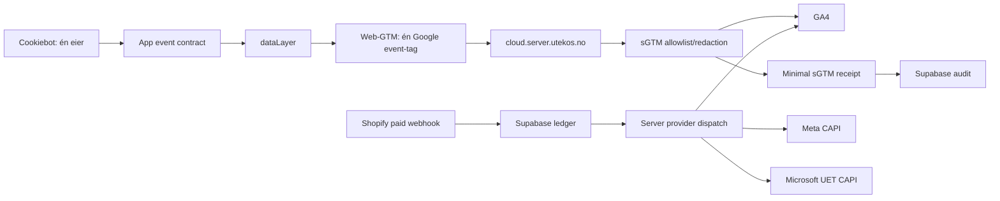

# Hvorfor Utekos bruker server-side tagging

Statusdato: 2026-07-12.

Dette er beslutningsdokumentet for rollen til
`https://cloud.server.utekos.no`. Den detaljerte
produksjonsanalysen, eventmatrisen og gapregisteret ligger i
[server-side-tagging.md](server-side-tagging.md).

## Beslutning

Utekos skal bruke sGTM som en kontrollert førstepartsflate for
**Consent Mode-styrt Google browsertrafikk**. Eksplisitte
commerce-events skal i tillegg være service-gatet før de pushes.
sGTM skal ikke være et uavgrenset alternativt trackinglager, en
skjult reservekanal eller et argument for å sende samme event
flere ganger.

Supabase forblir kanonisk ledger, provider-audit og retry-system
for app-eide og server-eide hendelser. sGTM erstatter ikke
Supabase, og Supabase kan ikke hevdes å dekke sGTM før faktiske,
personvernrensede receipts finnes.

## Hva sGTM skal løse

### 1. Førsteparts transport

Google-script og Google browser-hits kan lastes og sendes via et
eid subdomene. Det reduserer antall direkte browserforbindelser
til Google og gir Utekos kontroll over inngangspunktet.

Nåværende produksjon realiserer denne delen:

- `gtm.js` serveres fra `cloud.server.utekos.no`;
- Google tag bruker det konfigurerte førsteparts-/same-site-
  subdomenet som transport-endepunkt via `server_container_url`;
  det er ikke same-origin med `https://utekos.no`;
- `/g/collect` mottar aktiv produksjonstrafikk;
- GA4-clienten videresender event data til GA4-tags.

Google sin oppdaterte dependency-serving-guide anbefaler nå CDN
som standardvalg og tagging-serveren som alternativ. Dette er et
senere cache-/latency-/kostvalg, ikke en erstatning for å lukke
personvern- og dobbelttellingsgapene først.

### 2. Personvern og dataminimering

Server-containeren kan allowliste, redigere, blokkere og
transformere data før vendor-tags får tilgang. Dette er den
viktigste strategiske grunnen til å drifte en egen
server-container.

Nåværende produksjon realiserer **ikke** denne delen:

- det finnes 0 transformations;
- GA4-taggene er eksponert for alle parsede event- og
  user-parametere; outbound-feltene er ikke Preview-verifisert;
- rå e-post har blitt sendt i measurement-URL og lagret i Cloud
  Run request logs;
- forekomsten er også observert i requests med `G100`/`npa=1` og
  denied/default-lignende `gcd`-mønstre. Den definitive
  consenttilstanden per hit må verifiseres i Tag Assistant.

Det er verre å ha en «privacy proxy» som logger rå PII enn å være
tydelig på at privacy-kontrollen ikke er implementert. Derfor
skal sGTM ikke omtales som personvernforbedrende før P0-gapet er
lukket og bevist.

### 3. Datakvalitet og normalisering

sGTM kan håndheve ett eventnavn, én currency/value-kontrakt,
forventede varefelter, stabil transaction ID og eksplisitt
event-ID før dispatch.

Nåværende produksjon realiserer ikke dette fullt ut. Samme
logiske event har flere produsenter og transportveier, og
sGTM-hits mangler dokumentert `event_id`. Resultatet er målbar
dobbelttelling.

### 4. Redusert browserarbeid

Én browser-stream kan i prinsippet distribueres videre fra
serveren, slik at færre vendorbiblioteker og requests kjøres på
brukerens enhet.

Nåværende produksjon realiserer dette bare for Google. Microsoft
UET og Clarity lastes av web-GTM, men sender fortsatt direkte fra
browser til Microsoft. Appen laster i tillegg egen UET, og Meta
Pixel, PostHog og andre klienter finnes fortsatt. sGTM er derfor
ikke en universell ytelsesgateway.

### 5. Operasjonell kontroll

Et produksjonsmodent sGTM-oppsett skal ha:

- eksplisitt client-claiming;
- versjonerte tags, triggers og transformations;
- Preview-bevis for inbound event data og outbound
  provider-request;
- Cloud Run kapasitet og alerts;
- event-ID-basert korrelasjon mot kanonisk ledger;
- klare rollback-versjoner og publiseringsgate.

Endpoint HTTP 200 er nødvendig, men beviser ingen av disse alene.

## Hva sGTM skal eie

| Ansvar                                      | Eier                           | Begrunnelse                                               |
| ------------------------------------------- | ------------------------------ | --------------------------------------------------------- |
| Google browser-loader og dependency serving | sGTM/Google tag gateway        | Førsteparts origin og kontrollert Google browsertransport |
| Google browser commerce-events              | Web-GTM → sGTM                 | Bevarer browser session/client context og Consent Mode    |
| Ingress allowlist/redaction                 | sGTM transformations           | Siste kontroll før server-tags                            |
| Google browser-eventkontrakt                | App dataLayer + web-GTM        | Én kanonisk event- og parameterdefinisjon                 |
| sGTM runtime health/latency/error-rate      | Cloud Run/Cloud Monitoring     | Infrastrukturbevis                                        |
| GTM-versjoner og publish/rollback           | GTM med eksplisitt godkjenning | Produksjonskritisk ekstern mutasjon                       |

## Hva sGTM ikke skal eie som standard

| Ansvar                            | Eier                                  | Hvorfor ikke sGTM nå                                                                |
| --------------------------------- | ------------------------------------- | ----------------------------------------------------------------------------------- |
| Kanonisk event ledger             | Supabase                              | Krever varig audit, SQL/read models og historikk                                    |
| Provider retry/dead letter        | Supabase queue                        | Krever deterministisk retry, status og replay policy                                |
| Shopify paid purchase truth       | Shopify webhook + Supabase            | Betalt ordre er et serverdomene-event, ikke en sidevisning                          |
| Meta CAPI                         | Eksisterende serveradapter + Supabase | Har event-ID, retry og Dataset Quality-audit; migrering ville skape ny duplikatfare |
| Microsoft UET CAPI                | Eksisterende serveradapter + Supabase | Krever UET token, `msclkid`, providerstatus og skip reason                          |
| PostHog product analytics         | Consent-gatet PostHog helper          | Produktanalyse, ikke provider-dispatch                                              |
| Rå brukerprofiler eller PII-lager | Ingen trackingflate                   | Bryter dataminimeringsprinsippet                                                    |

Meta eller Microsoft kan senere flyttes til sGTM, men bare som en
eksplisitt migrering med én eier, parallel-shadow uten
provider-dispatch, event-ID, consent og Supabase receipt. «sGTM
støtter en template» er ikke et tilstrekkelig arkitekturargument.

## Event-eierskapsprinsipper

### Én logisk handling, én konverteringshendelse

En brukerhandling skal ha én kanonisk producer og én aktiv
providertransport. Observability kan ha flere observatører, men
de må ikke opprette flere konverteringer.

Dette betyr konkret:

- én `page_view` per logisk navigation;
- én `add_to_cart` per vellykket cart mutation;
- én `begin_checkout` per checkout-start;
- én `purchase` per betalt ordre;
- én Microsoft UET base-loader og én UET event-owner.

### Browser-events og server-events er ulike domener

Browser-events er hendelser brukeren gjør på nettstedet og skal
normalt bruke browserens client/session context via sGTM.
Server-events er hendelser som oppstår eller blir autoritative på
serveren, som en Shopify paid webhook, og skal bruke den
kanoniske serverflyten.

Measurement Protocol skal supplere browsermåling med ekte
hendelser fra server/offline. Det skal ikke brukes som en
ubetinget kopi av en browser-event som allerede er sendt via
sGTM.

### Fallback må være eksklusiv

En reservekanal må vite at primærkanalen ikke leverte, og den må
bruke samme idempotency key. Et planlagt kall to minutter senere
uten sGTM-receipt er parallell sending, ikke failover.

### `event_id` er korrelasjon, ikke generell GA4-dedupe

`event_id` skal følge eventet gjennom app, dataLayer, sGTM, audit
og råeksport. Det gjør avvik etterprøvbare. GA4 bruker ikke
`event_id` som generell dedupe av vanlige events. `purchase` har
egen dedupe med identisk, unik `transaction_id`; derfor må
browser og webhook aldri bruke ulike ID-format.

## Consent- og PII-kontrakt

Før noe user-provided data kan vurderes på nytt, må alle disse
være sanne:

1. Automatisk DOM-skanning etter e-post, telefon og adresse er
   av.
2. Denied `ad_user_data` og relevante storage-signaler gir null
   UPD.
3. Bare uttrykkelig godkjente conversion-events kan få UPD.
4. Verdier normaliseres og SHA-256-hashes før de når request
   URL/logging.
5. sGTM transformation allowlister kun forventede hashed fields.
6. Ingen rå PII finnes i page URL, event params, Cloud Logging,
   Preview, Supabase eller provider payload.
7. Juridisk/personvernansvarlig har godkjent formål, retention og
   tilgang.

En server transformation alene er ikke nok: Cloud Run kan logge
request URL før transformationen kjører. Kildestopp i Google
tag/browser er obligatorisk.

## Audit-kontrakt

Supabase skal skille mellom:

- `client_observed`: appen observerte at et browser-event ble
  dispatch-et;
- `server_direct`: appserveren kalte provider direkte;
- `server_retry`: queue-worker kalte provider;
- provider response: faktisk HTTP/providerutfall;
- sGTM ingress receipt: bare container/client/event-felter som en
  dokumentert mekanisme faktisk observerer;
- tag execution receipt: bare tag/status/tid som GTM Monitoring
  API eller tilsvarende pålitelig callback faktisk returnerer.

Ingen rad skal kalles `succeeded` bare fordi appen forventer at
web-GTM vil sende eventet. En eventuell receipt skal være signert
og dataminimert, og den må skille ingress-observasjon,
tag-execution og faktisk provider response. Den kan bare
inneholde felter den dokumenterte callbacken pålitelig
observerer. Den skal ikke inneholde client-ID, e-post, full URL,
query eller rå payload, og den skal aldri utlede andre tags sin
status.

## Hvorfor dagens potensial er misbrukt

Nåværende løsning betaler kompleksitets- og driftskostnaden ved
sGTM uten å få hele gevinsten:

- den fungerer som first-party Google proxy, men mangler
  transformations;
- den har en ubrukt Cookiebot signal-client og ubrukt MP-client;
- den sender browser-events samtidig som Supabase sender dem
  direkte;
- den har ingen receipts i kanonisk audit;
- den har min instances effektivt `0`, og ingen Cloud Monitoring
  alert policies ble observert i det auditerte prosjektet;
- den serverer en Google-tag-konfigurasjon som automatisk samler
  PII;
- web-containeren har overtatt Cookiebot og UET selv om appen
  allerede eier dem;
- grønne loader-smokes har skjult event-, consent- og
  datakvalitetsfeil.

Det underutnyttede potensialet er ikke «flere provider-tags». Det
er strengere kontroll: færre produsenter, mindre data, bedre
redaction, dokumentert consent, event-ID-korrelasjon og
operasjonelle varsler.

## Målarkitektur

I denne modellen:

- browser-Google går én gang gjennom sGTM;
- ekte server-events går én gang gjennom server-dispatch;
- Supabase er revisjonsfasit for begge, men med ærlig
  receipt-semantikk;
- ingen PII når ingress/logging;
- provider-tags kan ikke se felter de ikke trenger.

## Når sGTM er «ferdig»

sGTM kan først omtales som produksjonsmodent når:

- PII-incidenten er begrenset og eksisterende logger er vurdert;
- pageview- og commerce-duplikater er borte;
- purchase-taggen bare matcher riktig client;
- transformations håndhever en dokumentert kontrakt;
- én Cookiebot- og én UET-eier er valgt;
- event-ID er synlig end-to-end;
- Supabase-receipts og providerstatus har korrekt semantikk;
- Cloud Run har verifisert kapasitet, minst tre instanser hvis
  den offisielle redundansanbefalingen følges, og aktive alerts;
- Preview, browser network, Cloud Run, Supabase og GA4 viser
  samme kontrollhendelse nøyaktig én gang.

## Kilder

- [Google: server-side tagging overview](https://developers.google.com/tag-platform/tag-manager/server-side/overview)
- [Google: send data to server-side Tag Manager](https://developers.google.com/tag-platform/tag-manager/server-side/send-data)
- [Google: transformations](https://developers.google.com/tag-platform/tag-manager/server-side/transformations)
- [Google: consent mode for server-side tagging](https://developers.google.com/tag-platform/tag-manager/server-side/consent-mode)
- [Google: monitor sGTM infrastructure](https://developers.google.com/tag-platform/learn/sst-fundamentals/9-sst-monitoring)
- [Google: GTM template Monitoring API](https://developers.google.com/tag-platform/tag-manager/templates/monitoring)
- [Google Analytics: user-provided data collection](https://support.google.com/analytics/answer/14077171)
- [Google Analytics: avoid PII](https://support.google.com/analytics/answer/6366371)
- [Google Analytics: Measurement Protocol](https://developers.google.com/analytics/devguides/collection/protocol/ga4)
- [Google Analytics: purchase transaction-ID dedupe](https://support.google.com/analytics/answer/12313109)
- [Google Cloud: request logs and routing](https://docs.cloud.google.com/logging/docs/api/platform-logs)
- [Supabase: Queues](https://supabase.com/docs/guides/queues)

Produksjons-, GTM-, Google-tag-, Cloud Logging-, env- og
deploymutasjoner, samt mutasjoner i Supabase, følger
[DEPLOYMENT.md](../../DEPLOYMENT.md) og krever eksplisitt
godkjenning.
